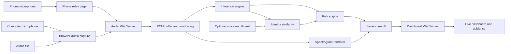
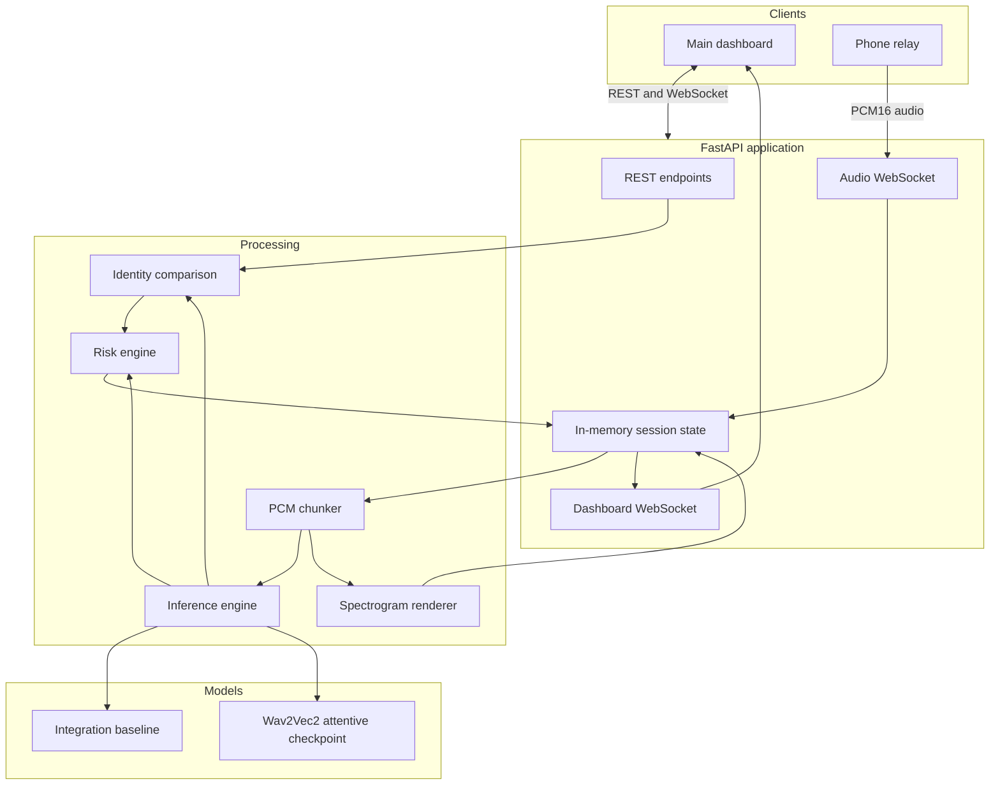
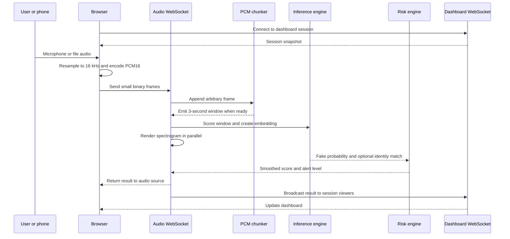
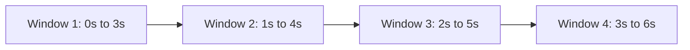
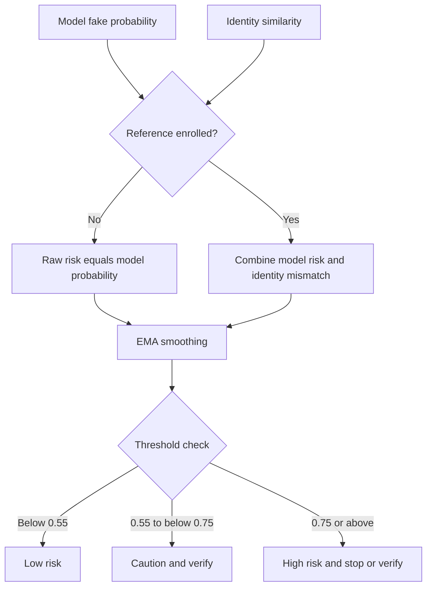
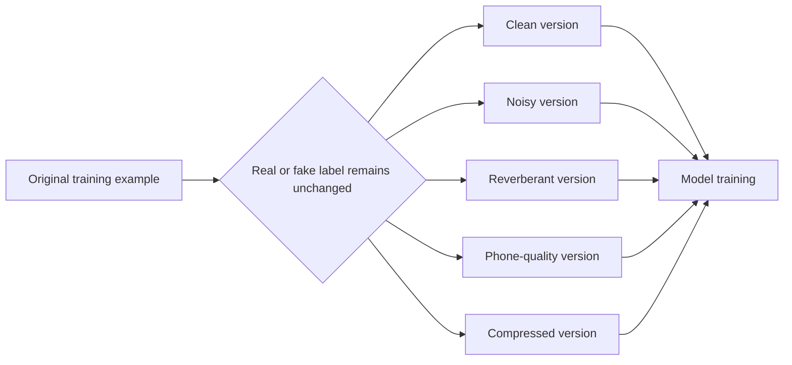
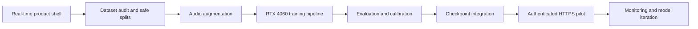

# SvaraSentry

> Real-time voice-clone risk monitoring for live microphone, phone-relay, and audio-file input.

SvaraSentry is a Dockerized application that receives live audio, analyzes overlapping
three-second windows, and continuously updates an operational dashboard with voice-clone
risk, signal quality, spectrograms, identity similarity, latency, and recommended action.

The project is designed as a complete real-time product shell around a replaceable machine
learning detector. The streaming, dashboard, session, risk, and checkpoint-loading systems
already work. The current default scorer is an integration baseline; a trained detector must
be supplied before the risk score can be treated as a real deepfake prediction.

## Project at a glance

| Item | Current implementation |
|---|---|
| Product type | Real-time browser dashboard and FastAPI service |
| Audio sources | Computer microphone, browser-decoded audio file, or phone microphone relay |
| Runtime format | 16 kHz, mono, little-endian signed PCM16 |
| Analysis window | 3 seconds |
| Update stride | 1 second |
| Transport | REST plus session-scoped WebSockets |
| Default model | Clearly labelled integration baseline |
| ML boundary | PyTorch Wav2Vec2 encoder with an attentive binary-classification head |
| Optional identity signal | In-memory reference voice enrollment and cosine similarity |
| Storage | No audio, account, or audit-history persistence |
| Deployment | Development, ML-runtime, and production Docker targets |
| Automated verification | 15 tests covering API, WebSockets, streaming, signals, risk, enrollment, and manifests |

## The problem

Modern voice-generation systems can imitate a known person and can be used during calls to
request credentials, money transfers, or sensitive information. A useful defensive system
must operate while the conversation is happening, tolerate ordinary microphones and noisy
channels, and present a result that a non-technical user can understand.

## The solution

SvaraSentry converts incoming audio to a consistent format, creates overlapping analysis
windows, runs the selected inference engine, optionally compares the voice with an enrolled
reference, smooths the resulting score, and displays clear low/caution/high guidance.



## What is complete

- Responsive monitoring dashboard with risk gauge, timeline, signal state, model state,
  latency, identity status, event history, spectrogram, and response guidance.
- Computer microphone capture and browser-side audio-file decoding.
- A separate phone relay page for sending phone microphone audio into a matching dashboard
  session.
- Browser-side downsampling and PCM16 conversion.
- Session-scoped audio and dashboard WebSockets.
- Arbitrary frame buffering with overlapping three-second windows emitted every second.
- Source collision protection so a session cannot accidentally accept two audio sources.
- Integration baseline inference with a stable interface for the trained model.
- Lazy loading of a PyTorch checkpoint in ML mode.
- Spectrogram generation and basic signal-quality measurements.
- Exponential moving-average risk smoothing and configurable caution/high thresholds.
- Optional in-memory voice enrollment and identity mismatch contribution.
- Session caps, frame-size limits, and inactive-session expiry.
- Dataset manifest generation for WAV and FLAC files.
- Development, ML inference, and hardened production Docker configurations.
- Automated tests and GitHub Actions CI.

## Important model disclaimer

The default `baseline` mode is **not a trained voice-clone detector**. It generates a bounded
score from simple signal properties so that audio transport, dashboard updates, enrollment,
spectrograms, alerts, and deployment can be exercised before a trained checkpoint exists.

Do not represent baseline scores as proof that audio is real or synthetic. Real detection
requires a trained, evaluated, and calibrated checkpoint at:

```text
training/checkpoints/model.pt
```

## Runtime architecture

### High-level components



### Live-analysis sequence



### Windowing behavior

At 16 kHz, each analysis window contains 48,000 samples. A one-second stride advances by
16,000 samples, so adjacent windows overlap by two seconds.



The first score arrives after three seconds of audio; subsequent scores arrive approximately
once per second.

## Risk decision logic

The inference engine produces `fake_probability` in the range 0 to 1. When no reference voice
is enrolled, that value becomes the raw risk score. When a reference exists, identity mismatch
contributes 20 percent:

```text
identity_mismatch = 1 - identity_match
raw_risk = 0.8 * fake_probability + 0.2 * identity_mismatch
```

The risk engine then applies an exponential moving average:

```text
smoothed = alpha * raw_risk + (1 - alpha) * previous_smoothed
```

Default settings:

| Setting | Default |
|---|---:|
| EMA alpha | 0.35 |
| Caution threshold | 0.55 |
| High threshold | 0.75 |



Thresholds must eventually be chosen from validation data. The current values are operational
defaults, not statistically validated guarantees.

## Model architecture

The current ML boundary uses the pretrained `facebook/wav2vec2-base` encoder followed by a
compact attentive classification head.

```mermaid
flowchart LR
    A[3-second mono waveform] --> B[Wav2Vec2 encoder]
    B --> C[Frame-level hidden states]
    C --> D[Layer normalization]
    D --> E[Linear projection]
    E --> F[GELU and dropout]
    F --> G[Temporal attention network]
    G --> H[Normalized attention weights]
    F --> I[Weighted temporal pooling]
    H --> I
    I --> J[256-dimensional embedding]
    J --> K[Binary classifier]
    K --> L[One real-versus-fake logit]
    L --> M[Sigmoid at inference]
```



The model returns three values:

| Output | Purpose |
|---|---|
| `logits` | Binary training signal; synthetic audio uses label 1 |
| `embedding` | Compact voice representation used by optional enrollment comparison |
| `attention` | Relative importance of temporal encoder frames; shown as a flagged dashboard region |

Training should use `BCEWithLogitsLoss`. The serving adapter applies `sigmoid` exactly once.
See [Model handoff contract](docs/model-handoff.md) for checkpoint details.

## Training-system architecture

Dataset preparation, augmentation, training, evaluation, calibration, and serving are separate
responsibilities. This lets different contributors work independently and keeps private dataset
access limited to the components that actually need it.

```mermaid
flowchart LR
    subgraph DatasetPreparation[Dataset preparation]
        RAW[Real and synthetic audio]
        AUDIT[Audit, validate, deduplicate]
        MANIFEST[Master manifest]
        SPLIT[Leakage-safe grouped splits]
        RAW --> AUDIT --> MANIFEST --> SPLIT
    end

    subgraph AudioPreparation[Audio preparation and augmentation]
        PREP[Decode, mono, 16 kHz]
        AUG[Training-only augmentation]
        WINDOW[Exactly 48,000 samples]
        PREP --> AUG --> WINDOW
    end

    subgraph GPUTraining[GPU training]
        LOADER[PyTorch DataLoader]
        MODEL[Wav2Vec2 detector]
        EVAL[Validation and evaluation]
        CAL[Threshold calibration]
        EXPORT[Checkpoint export]
        LOADER --> MODEL --> EVAL --> CAL --> EXPORT
    end

    subgraph ApplicationRuntime[Application runtime]
        LOAD[Checkpoint loader]
        LIVE[Live streaming inference]
        UI[Dashboard]
        LOAD --> LIVE --> UI
    end

    SPLIT --> PREP
    WINDOW --> LOADER
    EXPORT --> LOAD
```



### Purpose of audio augmentation

Training recordings are often cleaner and more consistent than audio captured from a real
phone, laptop, room, or network call. An unaugmented model may accidentally learn that a
particular codec, loudness, microphone, or noise floor means “real” or “fake.”

The augmentation component creates realistic variations of training audio—such as background
noise, reverberation, volume changes, filtering, resampling, speed changes, and optional codec
degradation—without changing its label.



Its purpose is to teach the detector to ignore ordinary recording conditions and focus on
voice-generation evidence. It runs only while training. Validation, testing, and live inference
must remain deterministic and must not use random augmentation.

The augmentation module has a narrow contract:

```text
Input:  decoded mono waveform
Output: float32 mono waveform, 16 kHz, exactly 48,000 samples
Label:  unchanged
```

It does not collect the dataset, choose labels, split speakers, train the model, or run in the
live application.

### Recommended training flow

1. Collect genuine and synthetic speech with reliable labels and metadata.
2. Validate files, calculate hashes, remove duplicates, and audit class/source balance.
3. Split by speaker, original utterance, and data source—not randomly by file.
4. Decode as mono float32 audio and resample to 16 kHz.
5. Apply randomized augmentation only to the training split.
6. Produce three-second windows matching the live runtime.
7. Initially freeze the Wav2Vec2 encoder and train the attentive head.
8. Unfreeze selected upper encoder layers and fine-tune with a smaller learning rate.
9. Use CUDA mixed precision and gradient accumulation for an 8 GB RTX 4060.
10. Select checkpoints using validation metrics rather than training accuracy.
11. Evaluate on unseen speakers, generators, languages, noise, rooms, and codecs.
12. Calibrate thresholds using validation predictions.
13. Export the checkpoint in the documented runtime format.
14. Compare offline predictions with live application output before demonstration.

## Repository structure

```text
SvaraSentry/
├── backend/
│   ├── main.py                 # FastAPI routes, WebSockets, sessions, orchestration
│   ├── streaming.py            # PCM buffering and overlapping windows
│   ├── inference.py            # Inference interface and integration baseline
│   ├── model_inference.py      # Lazy PyTorch checkpoint adapter
│   ├── risk_engine.py          # Identity fusion, smoothing, and alert levels
│   ├── spectrogram.py          # Spectrogram, signal metrics, demo embeddings
│   ├── audio_io.py             # Uploaded-audio decoding and resampling
│   └── config.py               # Environment configuration
├── frontend/
│   ├── index.html              # Main dashboard
│   ├── dashboard.js            # Capture, streaming, monitoring, rendering
│   ├── style.css               # Dashboard design
│   ├── phone_relay.html        # Minimal phone relay surface
│   ├── phone_relay.js          # Phone capture and PCM transport
│   └── phone_relay.css
├── data_pipeline/
│   └── build_manifest.py       # Labelled WAV/FLAC manifest builder
├── training/
│   ├── model.py                # Wav2Vec2 attentive detector
│   └── checkpoints/            # Local checkpoint destination
├── tests/                      # API and processing test suite
├── docs/                       # Technical handoff documentation
├── compose.yaml                # Development and ML services
├── compose.production.yaml     # Hardened production service
├── Dockerfile                  # Runtime, development, and ML targets
└── Makefile                    # Common commands
```

## API and transport

### REST endpoints

| Method | Path | Purpose |
|---|---|---|
| `GET` | `/` | Main dashboard |
| `GET` | `/phone` | Phone microphone relay |
| `GET` | `/health` | Runtime and checkpoint health |
| `GET` | `/api/config` | Browser-safe runtime configuration |
| `GET` | `/api/sessions` | In-memory session summaries |
| `GET` | `/api/sessions/{session_id}` | One session summary |
| `POST` | `/api/sessions/{session_id}/reset` | Reset streaming and risk history |
| `POST` | `/api/sessions/{session_id}/enrollment` | Enroll at least two seconds of reference audio |
| `DELETE` | `/api/sessions/{session_id}/enrollment` | Remove the in-memory reference embedding |

Interactive OpenAPI documentation is available at <http://127.0.0.1:8000/docs>.

### WebSockets

| Path | Direction | Purpose |
|---|---|---|
| `/ws/audio/{session_id}` | Audio source to backend, results back to source | PCM transport and analysis |
| `/ws/dashboard/{session_id}` | Backend to every matching viewer | Snapshot, source, enrollment, reset, and result updates |

Audio frames must be little-endian signed 16-bit mono PCM and no larger than 64 KB by default.
The browser handles resampling before transmission.

Example result with the large base64 spectrogram abbreviated:

```json
{
  "type": "result",
  "session_id": "demo-1",
  "chunk_index": 4,
  "timestamp": 6.0,
  "risk_score": 0.42,
  "smoothed_risk": 0.37,
  "alert_level": "none",
  "spectrogram_png_b64": "...",
  "flagged_region": null,
  "identity_match": null,
  "voice_enrolled": false,
  "model_kind": "integration-baseline",
  "signal": {
    "rms_dbfs": -22.1,
    "peak": 0.41,
    "zero_crossing_rate": 0.08,
    "state": "speech"
  },
  "processing_ms": 18.4
}
```

## Running locally

Docker is the canonical environment.

```bash
docker compose up --build app
```

Or, when GNU Make is installed:

```bash
make up
```

Open:

- Dashboard: <http://127.0.0.1:8000>
- Phone relay: <http://127.0.0.1:8000/phone>
- API documentation: <http://127.0.0.1:8000/docs>

The first image build installs dependencies. Source directories are bind-mounted and Uvicorn
reloads during development.

### Quick health check

```bash
curl -s http://127.0.0.1:8000/health
curl -s http://127.0.0.1:8000/api/config
```

Baseline-mode health output:

```json
{
  "status": "ok",
  "model": "integration-baseline",
  "mode": "baseline",
  "checkpoint_loaded": false
}
```

### Stop services

```bash
docker compose --profile ml down
```

## Manual demonstration

1. Open the main dashboard and keep the default session ID `demo-1`.
2. Choose a computer microphone or an audio file of at least three seconds.
3. Allow microphone access when prompted.
4. Wait three seconds for the first result.
5. Confirm the risk gauge, signal status, spectrogram, latency, and timeline update.
6. Optionally enroll at least two seconds of reference speech and repeat the stream.
7. To demonstrate the phone relay, open `/phone` from a phone, enter the same session ID, and
   start the relay while watching the dashboard.

Mobile browsers normally require a trusted HTTPS origin for microphone access. A phone also
cannot reach the computer through `127.0.0.1`; use a trusted-network HTTPS hostname or tunnel.
Authentication is not yet implemented, so limit the current relay to controlled demos.

## Automated verification

```bash
docker compose run --rm app python -m pytest
docker compose run --rm app ruff check backend data_pipeline training tests
```

Equivalent Make targets:

```bash
make test
make lint
```

The 15 tests cover:

- Health, configuration, dashboard, and phone surfaces
- WebSocket result contracts and maximum frame size
- Voice enrollment and deletion
- Uploaded-audio resampling
- Baseline score bounds and signal metrics
- Spectrogram generation and voice similarity
- Overlapping streaming windows and invalid partial samples
- Dataset manifest generation
- Risk smoothing, thresholds, and identity mismatch

GitHub Actions builds the development image and runs both pytest and Ruff for pushes and pull
requests.

## Building the dataset manifest

Place private data under ignored directories and build a CSV:

```bash
python -m data_pipeline.build_manifest \
  --real data/team_recordings \
  --fake data/sarvam_generated \
  --output data/dataset_manifest.csv
```

The current builder discovers WAV and FLAC files and writes:

```text
path,label,language,speaker,source
```

Filenames may encode optional metadata as:

```text
speaker__language__anything.wav
```

Otherwise speaker and language are recorded as `unknown`. Before serious training, extend the
manifest with duration, file hash, generator, codec, utterance ID, and leakage-safe split.

## RTX 4060 training direction

The current ML Docker target loads checkpoints for inference; a dedicated training entry point
still needs to be implemented. For an RTX 4060 with approximately 8 GB VRAM, the planned setup
is:

- CUDA-enabled PyTorch in a dedicated Python 3.11 or 3.12 environment
- Three-second, 48,000-sample batches
- Mixed-precision training
- Initially frozen Wav2Vec2 encoder
- Small physical batch size plus gradient accumulation
- Later unfreezing of upper encoder layers with a smaller encoder learning rate
- Validation-driven checkpoint selection and early stopping
- Evaluation using ROC-AUC, PR-AUC, EER, false-positive rate, and confusion matrices

Verify GPU access before training:

```bash
nvidia-smi
python -c "import torch; print(torch.cuda.is_available()); print(torch.cuda.get_device_name(0))"
```

## Loading a trained model

The checkpoint format is documented in [Model handoff contract](docs/model-handoff.md). Once a
compatible file exists at `training/checkpoints/model.pt`:

```bash
docker compose stop app
docker compose --profile ml up --build app-ml
```

Confirm:

```bash
curl -s http://127.0.0.1:8000/health
```

Expected ML-mode fields:

```json
{
  "status": "ok",
  "model": "wav2vec2-attentive",
  "mode": "checkpoint",
  "checkpoint_loaded": true
}
```

Before presenting model quality, compare known genuine and synthetic clips against an offline
evaluator and document the dataset, threshold, calibration method, and measured error rates.

## Configuration

Defaults are listed in `.env.example`:

| Variable | Default | Meaning |
|---|---|---|
| `SVARASENTRY_MODEL_MODE` | `baseline` | `baseline` or `checkpoint` |
| `SVARASENTRY_CHECKPOINT` | `/app/training/checkpoints/model.pt` | Checkpoint path inside Docker |
| `SVARASENTRY_SAMPLE_RATE` | `16000` | Canonical sample rate |
| `SVARASENTRY_WINDOW_SECONDS` | `3` | Analysis window |
| `SVARASENTRY_STRIDE_SECONDS` | `1` | Window update stride |
| `SVARASENTRY_RISK_ALPHA` | `0.35` | EMA smoothing weight |
| `SVARASENTRY_CAUTION_THRESHOLD` | `0.55` | Caution boundary |
| `SVARASENTRY_HIGH_THRESHOLD` | `0.75` | High-risk boundary |
| `SVARASENTRY_SESSION_TTL_SECONDS` | `3600` | Inactive session expiry |
| `SVARASENTRY_MAX_SESSIONS` | `200` | In-memory session cap |
| `SVARASENTRY_MAX_FRAME_BYTES` | `64000` | Audio WebSocket frame limit |

Copy `.env.example` to `.env` and ensure any variable that should affect a Compose service is
also referenced by that service's `environment` section.

## Privacy, security, and limitations

### Current protections

- Audio frames and enrollment embeddings remain in memory only.
- Uploaded enrollment audio is size-limited.
- WebSocket frames and total sessions are bounded.
- Inactive sessions expire.
- A session accepts only one active audio source.
- Security-related HTTP headers are added.
- The production container is read-only, drops Linux capabilities, and enables
  `no-new-privileges`.

### Work still required for public deployment

- User authentication and session authorization
- Trusted HTTPS and secure reverse-proxy configuration
- Rate limiting and abuse protection
- Explicit consent, privacy policy, and retention policy
- Persistent audit history if product requirements demand it
- Stronger origin controls and deployment-specific CSP review
- Monitoring, structured logs, and operational alerts
- Trained-model evaluation, calibration, drift monitoring, and version rollback
- Independent security and privacy review

SvaraSentry should provide a risk signal and verification guidance, not a claim of absolute
identity or authenticity.

## Roadmap



Near-term priorities:

1. Complete dataset auditing and grouped split generation.
2. Implement and test training-only audio augmentation.
3. Build the CUDA training and evaluation entry points.
4. Export and validate the first trained checkpoint.
5. Add authentication and HTTPS deployment controls.
6. Run a controlled pilot and measure false positives and missed detections.

## Suggested presentation structure

This README can be translated directly into a slide deck:

1. **Title:** SvaraSentry—real-time voice-clone risk monitoring
2. **Problem:** Fraud and social engineering using synthetic voices
3. **Proposed solution:** Live, understandable risk guidance
4. **User journey:** Microphone/file/phone relay to dashboard
5. **System architecture:** Client, FastAPI, processing, inference, dashboard
6. **Streaming design:** Three-second windows with one-second updates
7. **Model architecture:** Wav2Vec2 plus attentive classification head
8. **Risk engine:** Model score, optional identity signal, smoothing, thresholds
9. **Training plan:** Dataset, augmentation, GPU fine-tuning, evaluation, calibration
10. **Current progress:** Completed engineering subsystems and automated tests
11. **Limitations:** Baseline model, no authentication, no public deployment yet
12. **Roadmap:** Trained checkpoint, secure pilot, monitoring, iteration

## License and responsible use

No license file is currently included. Add an explicit license before external distribution or
reuse. Confirm that every dataset, noise sample, room impulse response, pretrained model, and
generated recording permits the intended research or commercial use.

Use the system only with appropriate consent and authorization. Do not use enrolled voices or
recordings to impersonate people, evade safeguards, or make unsupported claims about a person's
identity.
