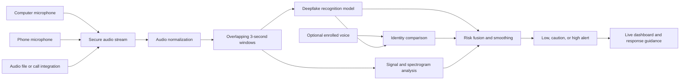
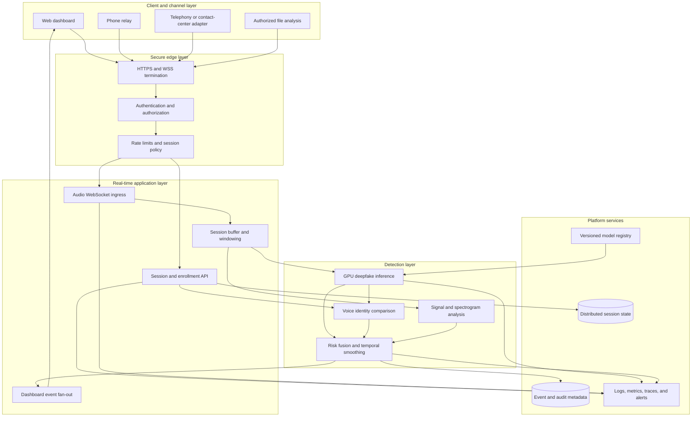
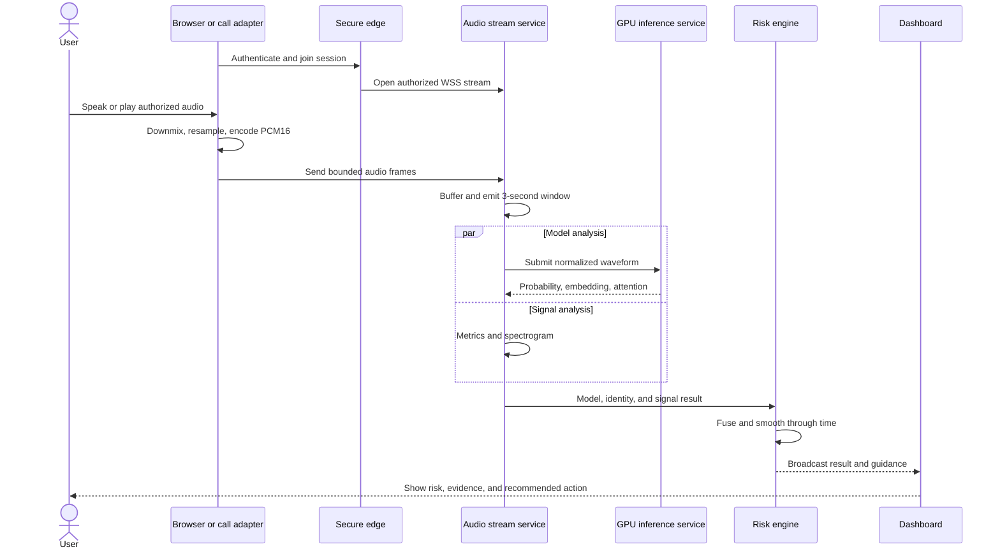
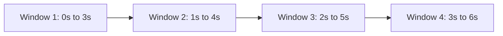
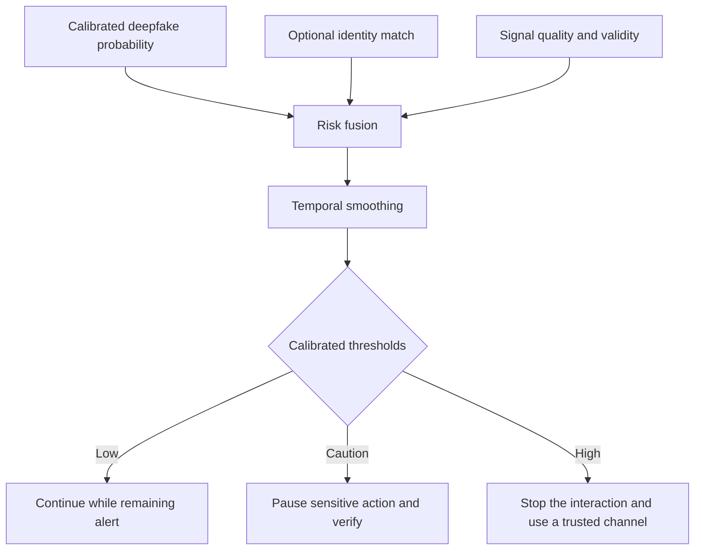
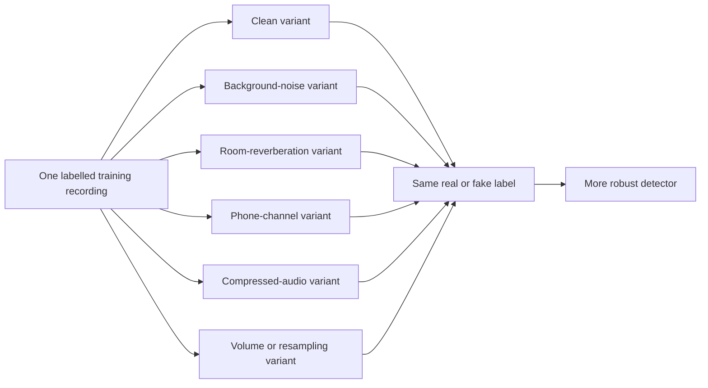
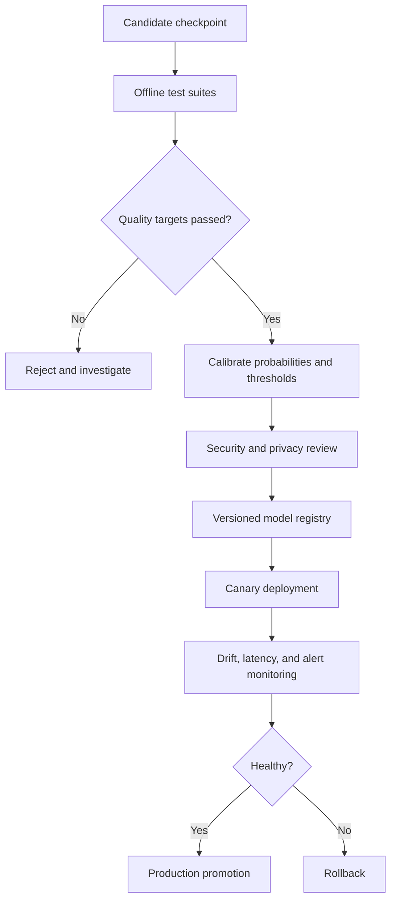

# ChhayaSwara

> Real-time AI voice-deepfake recognition and identity-risk monitoring.

ChhayaSwara protects live voice interactions by continuously analyzing speech for signs of
AI generation or voice cloning. It accepts audio from a computer microphone, uploaded file,
or phone relay; evaluates overlapping speech windows with a trained anti-spoofing model; and
turns the result into clear, actionable guidance on a live dashboard.

The product is intended for fraud prevention, identity verification, security operations,
and high-risk conversations where a synthetic voice could be used to request money,
credentials, access, or confidential information.

## Executive summary

| Item | Product design |
|---|---|
| Primary function | Detect likely AI-generated or voice-cloned speech during a live interaction |
| Users | Individuals, fraud teams, call centers, banks, enterprises, and security operations teams |
| Inputs | Computer microphone, phone microphone relay, audio file, or an integrated voice channel |
| Audio contract | 16 kHz mono speech, processed as overlapping three-second windows |
| Detection model | Fine-tuned Wav2Vec2 encoder with an attentive anti-spoofing classification head |
| Optional identity check | Compare live voice embeddings with an enrolled reference voice |
| Outputs | Deepfake probability, smoothed risk, alert level, signal quality, suspicious region, and response guidance |
| User experience | First assessment after three seconds, then approximately one update per second |
| Deployment | Containerized services with authenticated HTTPS/WSS access and scalable GPU inference |
| Privacy model | Ephemeral audio processing by default, encrypted metadata and evidence only when policy permits |

## Technology stack

| Layer | Technology |
|---|---|
| Web application | Next.js, React, TypeScript, responsive dashboard, and phone-relay interface |
| Browser audio | MediaDevices `getUserMedia`, Web Audio API, AudioContext, and HTML Canvas |
| API and real-time transport | Python 3.11+, FastAPI, Uvicorn, REST endpoints, and WebSockets |
| Audio processing | 16 kHz mono PCM16, NumPy, SoundFile/libsndfile, windowing, resampling, and signal-quality analysis |
| Deepfake-recognition model | PyTorch, Hugging Face Transformers, Wav2Vec2/XLSR encoder, attentive pooling, and binary classification head |
| Training and evaluation | CUDA-enabled PyTorch DataLoader, scikit-learn metrics, ROC-AUC, PR-AUC, EER, and sliced evaluation |
| Audio augmentation | Custom seeded PyTorch pipeline with OpenSLR SLR28 noise/RIR assets, gain, filtering, clipping, speed changes, and real Opus/VoIP codec round-trips through FFmpeg |
| Dataset and manifests | ASVspoof 2019 LA protocols, project and Indian-language speech sources, CSV manifests, and speaker-aware split validation |
| Risk and identity layer | Probability smoothing, configurable alert thresholds, learned voice embeddings, and cosine similarity |
| Explainability and visualization | Model-attention regions, NumPy STFT spectrograms, Pillow image rendering, and live risk timelines |
| GPU acceleration | NVIDIA CUDA for RTX-class local training and automatic CPU/GPU inference selection |
| Testing and code quality | pytest, Ruff, HTTPX, deterministic seeds, integration tests, and GitHub Actions CI |
| Packaging and delivery | Multi-stage Docker images, Docker Compose, non-root containers, health checks, and versioned model checkpoints |
| Storage and privacy | Local/private datasets and checkpoints, Git-ignored generated assets, and ephemeral live-session audio by default |

The stack keeps one audio contract from data preparation through live inference: mono speech
at 16 kHz, analyzed in overlapping three-second windows. Wav2Vec2 provides the core speech
representation, while XLSR checkpoints allow the same training pipeline to extend across
Hindi and other Indian-language speech without replacing the surrounding application.

## Problem statement

Voice-generation systems can imitate a known person and can be used in social-engineering
attacks. A victim may hear a familiar voice asking for an urgent transfer, password reset,
one-time code, or sensitive document. Human hearing alone is not a dependable control because
synthetic speech quality continues to improve and phone channels hide many audible artifacts.

Organizations therefore need a system that can:

- evaluate speech while a call is still in progress;
- remain useful across microphones, rooms, languages, codecs, and network conditions;
- distinguish speech-authenticity risk from ordinary audio-quality problems;
- provide understandable guidance rather than an unexplained model score;
- integrate an optional known-voice comparison for higher-risk workflows;
- retain enough evidence for authorized review without unnecessarily storing raw conversations.

## Product solution

ChhayaSwara standardizes incoming audio, creates overlapping analysis windows, runs a trained
deepfake-recognition model, optionally compares the voice with an enrolled reference, smooths
short-term score fluctuations, and sends the result to every authorized dashboard watching the
session.



## Product capabilities

### Real-time recognition

- Processes continuous audio without waiting for the complete call.
- Produces the first assessment after one three-second window.
- Updates approximately once per second using two seconds of overlap.
- Shows both the latest model result and its recent history.
- Smooths isolated score spikes while remaining responsive to sustained risk.

### Multiple audio sources

- Computer microphone capture directly from the dashboard.
- Browser-decoded audio-file playback through the same live processing route.
- Phone relay page using the phone microphone and a matching session ID.
- A stable PCM/WebSocket contract for future telephony and contact-center adapters.

### Explainable operator view

- Deepfake-risk percentage and alert state.
- Timeline of recent raw and smoothed scores.
- Spectrogram for the analyzed window.
- Model-attention region indicating the most influential time interval.
- Signal state, RMS level, peak level, and clipping indication.
- Processing latency and analyzed-window count.
- Recommended action for low, caution, and high-risk situations.

### Optional identity verification

- Enroll a reference voice for a protected individual.
- Store only the derived embedding for the active session by default.
- Compare live embeddings with the enrolled reference.
- Combine identity mismatch with deepfake probability as a secondary signal.
- Remove the enrollment immediately when the operator ends or resets the workflow.

### Operational controls

- Authenticated and authorized session access.
- One active audio source per session to prevent accidental stream collisions.
- Bounded WebSocket frame size, session count, and in-memory resources.
- Inactive-session expiry.
- Health endpoints, structured telemetry, model-version tracking, and alert monitoring.
- Containerized deployment with read-only runtime filesystems and minimal privileges.

## Finalized system architecture

The production design separates low-latency streaming from GPU inference, risk aggregation,
dashboard delivery, and audit services. Components can scale independently according to call
volume and model load.



### Component responsibilities

| Component | Responsibility |
|---|---|
| Secure edge | Encrypt traffic, authenticate users, authorize sessions, and enforce request limits |
| Session API | Create and inspect sessions, reset analysis, and manage temporary voice enrollment |
| Audio ingress | Accept bounded PCM frames and enforce one authorized source per session |
| Session buffer | Reassemble arbitrary frames and emit fixed overlapping model windows |
| GPU inference | Run the versioned Wav2Vec2 anti-spoofing checkpoint |
| Signal analysis | Calculate audio quality indicators and generate a spectrogram |
| Identity comparison | Compare the live embedding with an optional enrolled embedding |
| Risk engine | Fuse signals, smooth risk through time, and assign an operational alert level |
| Event fan-out | Deliver snapshots and continuous updates to authorized viewers |
| Audit service | Store approved event metadata and model provenance without retaining raw audio by default |
| Observability | Monitor latency, failures, saturation, model distribution shifts, and service health |

## Live-analysis sequence



## Streaming and windowing

All live sources are converted to mono, 16 kHz, signed PCM16 before transport. The server can
accept frames of different sizes because it buffers them until a complete analysis window is
available.

At 16 kHz:

```text
3-second window = 48,000 samples = 96,000 PCM16 bytes
1-second stride = 16,000 samples = 32,000 PCM16 bytes
window overlap  = 2 seconds
```



This design balances context and responsiveness: three seconds gives the model enough speech
structure to analyze, while the one-second stride provides continuous updates.

## Deepfake-recognition model

ChhayaSwara uses a pretrained Wav2Vec2 speech encoder and fine-tunes it for binary
anti-spoofing. The encoder learns representations directly from raw speech, while a compact
attention head identifies useful temporal regions and produces the final authenticity logit.

```mermaid
flowchart LR
    A[3-second float32 waveform] --> B[Wav2Vec2 feature encoder]
    B --> C[Contextual speech representations]
    C --> D[Layer normalization]
    D --> E[Linear projection]
    E --> F[GELU and dropout]
    F --> G[Temporal attention network]
    G --> H[Normalized attention weights]
    F --> I[Attention-weighted pooling]
    H --> I
    I --> J[Voice and spoof embedding]
    J --> K[Binary classification head]
    K --> L[Authenticity logit]
    L --> M[Calibrated deepfake probability]
```



### Model outputs

| Output | Product use |
|---|---|
| Authenticity logit | Optimized with binary cross-entropy during training |
| Calibrated probability | Primary deepfake-recognition signal shown through the risk layer |
| Embedding | Optional comparison with an enrolled reference voice |
| Attention weights | Approximate influential time region for operator context |
| Model metadata | Version, calibration version, supported domains, and evaluation provenance |

Synthetic or cloned speech uses label `1`; genuine speech uses label `0`. Training uses
`BCEWithLogitsLoss`, and probability calibration is fitted separately using held-out validation
predictions.

## Risk and decision architecture

A single three-second probability can fluctuate because of silence, noise, overlapping speakers,
or difficult phonemes. The product therefore separates model inference from the operational risk
decision.



When voice enrollment is active, the default fusion form is:

```text
identity_mismatch = 1 - identity_match
combined_risk = model_weight * deepfake_probability
              + identity_weight * identity_mismatch
```

Production weights and alert thresholds are selected on representative validation data. They
must be versioned with the model and reviewed against the false-positive cost of each deployment.
Low-quality or non-speech windows should be marked as insufficient evidence rather than forced
into a confident authenticity decision.

## Training-system architecture

The training system is separated into dataset governance, waveform preparation, augmentation,
GPU optimization, evaluation, calibration, and model release.

```mermaid
flowchart LR
    subgraph Data[Dataset governance]
        RAW[Licensed real and synthetic speech]
        AUDIT[Validate and deduplicate]
        META[Speaker, language, source, and generator metadata]
        SPLIT[Leakage-safe grouped splits]
        RAW --> AUDIT --> META --> SPLIT
    end

    subgraph Audio[Waveform preparation]
        DECODE[Decode and downmix]
        RESAMPLE[Resample to 16 kHz]
        AUG[Training-only augmentation]
        CROP[Crop or pad to 48,000 samples]
        DECODE --> RESAMPLE --> AUG --> CROP
    end

    subgraph Train[RTX 4060 training]
        LOAD[PyTorch DataLoader]
        NET[Wav2Vec2 anti-spoofing model]
        OPT[Mixed-precision optimization]
        CHECK[Best-checkpoint selection]
        LOAD --> NET --> OPT --> CHECK
    end

    subgraph Release[Evaluation and release]
        TEST[Unseen-condition evaluation]
        CAL[Probability calibration]
        GATE[Quality and safety gate]
        EXPORT[Versioned model artifact]
        TEST --> CAL --> GATE --> EXPORT
    end

    SPLIT --> DECODE
    CROP --> LOAD
    CHECK --> TEST
```



### Audio augmentation: purpose in the architecture

Training datasets are usually cleaner and more consistent than real calls. Without controlled
augmentation, a model may accidentally associate a particular microphone, codec, loudness, room,
or noise floor with one label.

Audio augmentation creates realistic variants while preserving the original label:



Its sole purpose is to teach the detector to ignore ordinary channel conditions and focus on
deepfake evidence. It runs only during training. It does not collect data, assign labels, split
speakers, train the network, or modify live audio.

Its boundary is deliberately small:

```text
Input:  decoded mono training waveform
Output: float32 mono waveform at 16 kHz with exactly 48,000 samples
Label:  unchanged
```

### GPU training strategy

An RTX 4060 can fine-tune the model efficiently with memory-aware settings:

- CUDA-enabled PyTorch in a dedicated Python environment.
- Mixed-precision forward and backward passes.
- Encoder frozen during the first training phase.
- Projection, attention, and classifier trained first.
- Upper encoder layers gradually unfrozen for fine-tuning.
- Smaller learning rate for the pretrained encoder than for the new classification head.
- Small physical batch size with gradient accumulation.
- Gradient clipping, early stopping, and validation-driven checkpoint selection.
- Reproducible seeds, configurations, split manifests, and model artifacts.

### Leakage prevention

Individual audio files must not be randomly divided across splits. Related material can otherwise
appear in both training and testing and produce misleadingly high results.

Splits should be grouped by:

- speaker identity;
- original utterance or source recording;
- dataset origin;
- cloned target voice;
- synthesis or voice-conversion system when measuring unseen-generator performance.

A complete evaluation design includes:

```text
train
validation
test with unseen speakers
test with unseen generators
test with noisy and reverberant channels
test with telephone and compressed channels
```

## Evaluation and release criteria

Accuracy alone is not sufficient for a security-oriented detector. Every model release should
report:

- ROC-AUC and PR-AUC;
- Equal Error Rate;
- precision, recall, and F1 score;
- false-positive rate at selected operating thresholds;
- confusion matrix;
- calibration error and reliability curve;
- results by language, speaker group, source dataset, and generator;
- clean, noisy, reverberant, telephone, and compressed-channel performance;
- end-to-end inference latency and GPU throughput.



The product should communicate uncertainty. A score is a risk signal—not mathematical proof of
identity or authenticity—and sensitive actions should still use a trusted independent channel.

## Scalability design

### Horizontal scaling

- WebSocket ingress instances scale by active connection count.
- Session affinity or distributed session state keeps a live stream coherent.
- GPU inference workers scale independently according to queue delay and utilization.
- Model batching combines compatible windows without violating latency targets.
- Dashboard event fan-out uses distributed publish/subscribe when viewers and API replicas span
  multiple instances.
- Backpressure protects the system when incoming audio exceeds inference capacity.

### Reliability

- Readiness checks confirm that the model is loaded and warmed before receiving traffic.
- Failed inference produces an explicit unavailable state, never a fabricated low-risk score.
- Versioned checkpoints support canary deployment and immediate rollback.
- Timeouts and bounded queues prevent one session from exhausting shared resources.
- Metrics track ingestion delay, model latency, GPU memory, queue depth, dropped frames, and errors.

### Enterprise integration

The WebSocket audio contract can be adapted to:

- contact-center platforms;
- SIP or VoIP media gateways;
- banking verification workflows;
- customer-support consoles;
- security operations dashboards;
- recorded-call review systems.

## Privacy and security architecture

### Privacy principles

- Process raw audio ephemerally unless explicit policy and consent authorize retention.
- Store reference embeddings only for their intended scope and lifetime.
- Encrypt traffic in transit and protected records at rest.
- Minimize event metadata and define retention periods.
- Separate operational access from model-development dataset access.
- Record model version and decision metadata for authorized review.
- Support deletion and consent-withdrawal workflows.

### Security controls

- HTTPS/WSS with trusted certificates.
- Strong user authentication and role-based session authorization.
- Short-lived session credentials and non-guessable session identifiers.
- Origin checks, rate limiting, request-size limits, and abuse detection.
- Strict upload validation and malware scanning where file analysis is enabled.
- Read-only containers, minimal Linux capabilities, and non-root execution.
- Secrets supplied through a managed secret store rather than source control.
- Signed model artifacts and controlled model-registry permissions.
- Centralized audit logging, monitoring, alerting, and incident response.

## User experience

### Dashboard workflow

1. The operator signs in and creates or joins an authorized monitoring session.
2. Audio arrives from a microphone, file, phone relay, or integrated call channel.
3. The dashboard shows connection and signal readiness.
4. After three seconds, the first authenticity assessment appears.
5. Risk, signal quality, spectrogram, and model evidence update once per second.
6. Caution or high risk triggers an explicit verification response.
7. The operator ends the session and any temporary enrollment is removed according to policy.

### Response guidance

| Alert | Meaning | Recommended action |
|---|---|---|
| Low | No sustained deepfake evidence above the selected threshold | Continue cautiously; never treat the score as absolute proof |
| Caution | Evidence is uncertain or elevated | Pause sensitive actions and verify with a known fact or trusted channel |
| High | Sustained evidence is consistent with synthetic or mismatched speech | End or isolate the interaction and contact the person through a trusted saved channel |
| Insufficient signal | Silence, severe noise, clipping, or too little usable speech | Improve the audio or collect more speech; do not issue an authenticity conclusion |

## API and real-time contract

### Product endpoints

| Method | Path | Purpose |
|---|---|---|
| `GET` | `/health` | Service, model, and dependency readiness |
| `GET` | `/api/config` | Authorized client runtime configuration |
| `POST` | `/api/sessions` | Create an authorized monitoring session |
| `GET` | `/api/sessions/{session_id}` | Read session state and latest approved metadata |
| `POST` | `/api/sessions/{session_id}/reset` | Reset streaming and temporal risk state |
| `POST` | `/api/sessions/{session_id}/enrollment` | Create a temporary reference embedding |
| `DELETE` | `/api/sessions/{session_id}/enrollment` | Delete the temporary reference embedding |
| `WS` | `/ws/audio/{session_id}` | Send audio and receive source acknowledgements/results |
| `WS` | `/ws/dashboard/{session_id}` | Receive session snapshots and continuous risk events |

### Audio input

```text
encoding: little-endian signed PCM16
channels: 1
sample rate: 16,000 Hz
transport: bounded binary WebSocket frames
```

### Analysis result

```json
{
  "type": "result",
  "session_id": "session-7f2a",
  "chunk_index": 14,
  "timestamp": 16.0,
  "deepfake_probability": 0.82,
  "smoothed_risk": 0.78,
  "alert_level": "high",
  "evidence_quality": "usable_speech",
  "identity_match": 0.43,
  "voice_enrolled": true,
  "model_version": "chhayaswara-w2v2-1.0.0",
  "calibration_version": "cal-1.0.0",
  "flagged_region": {
    "time_offset_ms": [1120, 1280],
    "frequency_band": "model attention"
  },
  "signal": {
    "rms_dbfs": -22.1,
    "peak": 0.41,
    "zero_crossing_rate": 0.08,
    "state": "speech"
  },
  "processing_ms": 42.7
}
```

## Model artifact contract

Every released checkpoint carries the network state and the provenance required to reproduce
its behavior:

```python
torch.save(
    {
        "format_version": 1,
        "model_name": "facebook/wav2vec2-base",
        "hidden_size": 256,
        "state_dict": model.state_dict(),
        "label_mapping": {"real": 0, "fake": 1},
        "calibration": calibration_parameters,
        "thresholds": alert_thresholds,
        "metrics": evaluation_metrics,
        "languages": supported_languages,
        "dataset_version": dataset_version,
        "training_config": training_config,
        "source_commit": source_commit,
    },
    "training/checkpoints/model.pt",
)
```

Serving must validate the format version, expected architecture, calibration metadata, and model
integrity before declaring readiness.

## Repository structure

```text
ChhayaSwara/
├── backend/
│   ├── main.py                 # API, WebSockets, sessions, and orchestration
│   ├── streaming.py            # PCM buffering and overlapping windows
│   ├── inference.py            # Inference interface
│   ├── model_inference.py      # PyTorch checkpoint adapter
│   ├── risk_engine.py          # Risk fusion, smoothing, and alerts
│   ├── spectrogram.py          # Spectrograms, signal metrics, and embeddings
│   ├── audio_io.py             # Audio decoding and resampling
│   └── config.py               # Environment configuration
├── frontend/
│   ├── app/                    # Next.js dashboard and phone-relay routes
│   ├── components/             # Typed React monitoring and relay interfaces
│   ├── lib/                    # API, WebSocket, and PCM helpers
│   ├── public/                 # Browser audio-worklet assets
│   └── package.json            # Frontend scripts and dependencies
├── data_pipeline/
│   └── build_manifest.py       # Labelled audio manifest generation
├── training/
│   ├── model.py                # Wav2Vec2 attentive detector
│   └── checkpoints/            # Versioned model artifacts
├── tests/                      # API, streaming, signal, risk, and data tests
├── docs/                       # Engineering specifications and handoffs
├── compose.yaml                # Containerized services
├── compose.production.yaml     # Hardened deployment configuration
├── Dockerfile                  # Application and GPU runtime images
└── Makefile                    # Common development commands
```

## Running with a trained checkpoint

Place the validated artifact at:

```text
training/checkpoints/model.pt
```

Start the ML API and Next.js frontend:

```bash
docker compose --profile ml up --build app-ml frontend
```

Open:

- Dashboard: <http://127.0.0.1:3000>
- Phone relay: <http://127.0.0.1:3000/phone>
- API documentation: <http://127.0.0.1:8000/docs>

For standard baseline development, use:

```bash
docker compose up --build app frontend
```

The browser app is intentionally separate from the FastAPI service. For a phone on the same
network, set both `NEXT_PUBLIC_API_BASE` and `NEXT_PUBLIC_PUBLIC_ORIGIN` to reachable HTTPS/WSS
origins before starting the containers; browser microphone access on a phone requires HTTPS.

Verify model readiness:

```bash
curl -s http://127.0.0.1:8000/health
```

Expected result:

```json
{
  "status": "ok",
  "model": "wav2vec2-attentive",
  "mode": "checkpoint",
  "checkpoint_loaded": true
}
```

## Evidence-bound explanations

Each analysed window returns a deterministic explanation alongside the risk score. It is designed
for a non-technical operator: it reports the model score, the most influential audio time region,
signal-quality limitations, optional enrolled-voice similarity, and an appropriate action.

The live checkpoint currently uses a Wav2Vec2 encoder with a learned **temporal attention** head.
Its native evidence therefore identifies influential **time regions**, not a frequency region or
an AASIST graph. The spectrogram and acoustic features remain useful visual and quality context,
but are never used as a claim that a voice is real or fake.

For offline or GPU-backed analysis, the following opt-in causal checks can strengthen the time
attention evidence. They are disabled by default because they add model passes and can increase
live-stream latency:

```bash
CHHAYASWARA_MODEL_MODE=checkpoint
CHHAYASWARA_EXPLAIN_OCCLUSION=1        # silence each influential time region and re-score
CHHAYASWARA_EXPLAIN_BAND_OCCLUSION=1   # attenuate broad frequency bands and re-score
CHHAYASWARA_EXPLAIN_INTEGRATED_GRADIENTS=1
```

Band occlusion reports only broad-band score sensitivity; it must not be described as a proven
"fake frequency." True AASIST node, edge, and graph-attention evidence is intentionally marked
unavailable until an AASIST model adapter is added to the repository.

The optional language layer is deliberately separated from inference. Install it with
`pip install -e '.[explain]'`, supply an approved LangChain runnable in deployment code, and pass
only the deterministic explanation contract to it. The guardrail rejects unsupported wording and
falls back to the original deterministic explanation; no external LLM or provider is enabled by
default.

## Verification

Run the automated suite:

```bash
docker compose run --rm app python -m pytest
docker compose run --rm app ruff check backend data_pipeline training tests
docker compose run --rm frontend npm run typecheck
docker compose run --rm frontend npm run build
```

The system test strategy covers:

- audio decoding, downmixing, and resampling;
- frame bounds and overlapping window emission;
- WebSocket connection, source collision, and event contracts;
- GPU-model loading and output validation;
- enrollment lifecycle and identity comparison;
- risk fusion, smoothing, threshold boundaries, and insufficient-signal behavior;
- spectrogram and signal-quality output;
- session expiry, authorization, and resource limits;
- end-to-end latency and sustained-stream reliability;
- model evaluation and calibration regression gates.

## Success measures

The finalized product is judged across model quality, user value, performance, and safety:

| Area | Example measure |
|---|---|
| Recognition | EER, ROC-AUC, PR-AUC, and false-positive rate at the deployment threshold |
| Generalization | Performance on unseen speakers, generators, languages, codecs, and environments |
| Calibration | Agreement between predicted risk and observed error frequency |
| Responsiveness | First result after three seconds and subsequent updates near the one-second stride |
| Scalability | Concurrent sessions per ingress instance and windows per second per GPU |
| Reliability | Availability, dropped-frame rate, inference failures, and rollback time |
| Operator value | Time to notice risk, verification completion, and prevented unsafe actions |
| Privacy | Audio-retention compliance, deletion completion, and unauthorized-access incidents |

## Presentation-ready storyline

This README maps directly to a project presentation:

1. **Title:** ChhayaSwara—real-time AI voice-deepfake recognition
2. **Problem:** Synthetic voice fraud is difficult to identify during a live call
3. **Users and scenarios:** Individuals, banks, call centers, and security teams
4. **Solution:** Continuous detection with understandable response guidance
5. **User journey:** Audio source to live dashboard decision
6. **System architecture:** Secure edge, real-time services, GPU inference, and platform services
7. **Streaming design:** Three-second overlapping windows with one-second updates
8. **Model architecture:** Wav2Vec2 encoder and attentive anti-spoofing head
9. **Risk architecture:** Calibrated probability, optional identity, signal quality, and smoothing
10. **Training architecture:** Governed data, augmentation, RTX 4060 fine-tuning, and evaluation
11. **Scalability:** Independent ingress, GPU, state, fan-out, and monitoring layers
12. **Privacy and security:** Ephemeral processing, authorization, encryption, and audit controls
13. **Validation:** Generalization, calibration, latency, reliability, and release gates
14. **Impact:** Faster verification and safer decisions during suspicious voice interactions

## Responsible use

ChhayaSwara provides decision support, not absolute proof. Operators should verify high-impact
requests using an independent trusted channel. The system must be used with appropriate consent,
lawful authority, documented retention rules, and properly licensed datasets and model assets.

The detector must be evaluated for demographic, linguistic, device, and environmental performance
before use in consequential settings. No person should be denied access or accused of fraud solely
because of one automated score.
