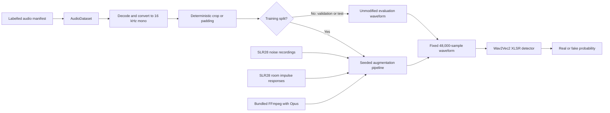
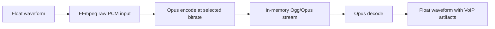

# Audio Augmentation and Docker Completion Report

**Project:** SvaraSentry  
**Completed on:** 6 September 2026  
**Implementation commit:** `62ab08c` — `feat: complete production audio augmentation pipeline`

## 1. Purpose of this work

This workflow completed the remaining audio-augmentation integration work and made the shared development environment reproducible.

The work covered four areas:

1. Installing real noise and room-response assets for augmentation.
2. Standardizing the Transformers version used by the training code.
3. Adding real VoIP codec degradation to the augmentation pipeline.
4. Fixing Docker, dependency, API-test, and lint inconsistencies introduced across recent team changes.

The dataset contents and labels were not altered by this work. Augmentation remains a separate, training-only module.

## 2. Final architecture



The augmentation module creates realistic versions of labelled training recordings. It teaches the detector not to mistake background noise, room echo, microphone response, loudness, or call compression for deepfake evidence.

It does **not** download datasets, assign real/fake labels, create train/test splits, train the model by itself, or modify live audio sent to the application.

## 3. SLR28 augmentation assets

The OpenSLR SLR28 `RIRS_NOISES` archive was downloaded from:

```text
https://www.openslr.org/resources/28/rirs_noises.zip
```

### Validation and extraction

- The archive was downloaded with `aria2c`.
- Archive integrity was checked before extraction; no errors were detected.
- The contents were separated into noise recordings and room impulse responses.
- Representative files were decoded successfully as mono, 16 kHz WAV audio.
- The ZIP archive was deleted only after the extracted files were validated.

### Final project layout

```text
data/augmentation_assets/
├── SLR28_README
├── noise/
│   ├── pointsource/
│   └── real_isotropic/
└── rir/
    ├── real/
    └── simulated/
```

### Verified asset counts

| Asset type | WAV files |
|---|---:|
| Noise recordings | 935 |
| Room impulse responses | 60,325 |

The complete extracted directory uses approximately 3.6 GB locally. It is intentionally excluded from Git and Docker build contexts.

## 4. Transformers and XLSR compatibility

The repository requires Transformers 4.x:

```text
transformers>=4.49,<5
```

The local environment previously contained Transformers 5.16.1, which did not satisfy that project constraint. It was replaced with:

```text
transformers 4.57.6
```

This dependency change did **not** delete or replace the downloaded XLSR model. The checkpoint remains at:

```text
training/pretrained/wav2vec2-large-xlsr-53
```

The local XLSR detector was loaded and given a test waveform successfully. The output logits and embedding were finite. GPU verification used the NVIDIA GeForce RTX 4060 Laptop GPU and reached approximately 1.55 GiB of allocated GPU memory during the smoke test.

## 5. Real codec augmentation

The earlier phone-channel effect mainly simulated restricted telephone frequency response. That is useful, but it does not reproduce lossy compression artifacts introduced by a real VoIP call.

The completed pipeline now performs a real Opus encode-decode round trip:



### Codec configuration

```yaml
codec:
  enabled: true
  probability: 0.20
  codec: opus
  bitrates_kbps: [12, 16, 24]
  application: voip
```

Opus was selected because the live phone relay uses a browser and WebSocket path, making VoIP degradation the closest match to the current demonstration architecture.

The codec stage:

- Uses a seeded bitrate selection for reproducibility.
- Encodes and decodes through subprocess pipes.
- Does not leave temporary compressed recordings on disk.
- Uses system FFmpeg when available.
- Falls back to the FFmpeg binary bundled by `imageio-ffmpeg`.
- Records the codec, bitrate, application mode, and FFmpeg version in augmentation metadata.
- Preserves the final three-second, 48,000-sample audio contract.

The dependency was added to both project dependency definitions:

```text
imageio-ffmpeg>=0.6,<1
```

## 6. Augmentation smoke test

The completed configuration was instantiated against the full local SLR28 asset collection. Startup validation discovered all 935 noise files and 60,325 RIR files.

A smoke report was then generated from 32 real ASVspoof training samples. Across those samples, the run exercised:

- Noise addition
- Real or simulated reverberation
- Filtering and telephone-band simulation
- Resampling
- Speed changes
- Gain changes
- Saturation
- Amplitude safety
- Real Opus codec compression
- Unchanged samples, as expected from probabilistic augmentation

The report was written to:

```text
data/reports/augmentation-smoke.jsonl
```

## 7. Docker and `.dockerignore` corrections

### `.dockerignore`

The Docker build context now excludes local and generated files that do not belong in an application image:

```text
.venv
venv
data/raw
data/augmentation_assets
data/processed
data/manifests
data/reports
training/pretrained
training/checkpoints/*
runs
```

This prevents the local 6.2 GB virtual environment, 3.6 GB augmentation assets, raw datasets, generated reports, checkpoints, and downloaded XLSR model from accidentally bloating the Docker image.

The clean verification build transferred a Docker context of only **1.30 MB**, confirming that the ignore rules work.

### Development image dependencies

The Docker development stage was corrected to install:

- CPU-compatible PyTorch and torchaudio from the PyTorch CPU index.
- The complete ML dependency list.
- The complete development/test dependency list.
- Tests after dependency installation, allowing dependency layers to remain cached when only tests change.

System FFmpeg was not added to the image. The declared `imageio-ffmpeg` dependency supplies the required binary without adding the much larger operating-system FFmpeg package.

### HTTP test dependency

The development dependency was aligned with the current FastAPI/Starlette test client:

```text
httpx2>=2,<3
```

## 8. Team-code inconsistencies corrected

The latest merged phone-relay and spectrogram changes exposed several test and lint issues. The following corrections were included:

- The pairing test now sends enough PCM audio to produce the first three-second analysis result.
- An invalid pairing token is accepted at WebSocket level and then closed with policy code `1008`, allowing the behavior to be tested explicitly.
- Imports, unused names, exception handling, gallery generation, and duplicated test helpers were cleaned up.
- Test signal conversion now handles non-finite values safely before PCM conversion.
- Production asynchronous signal processing was preserved; a restricted test sandbox had made it appear to hang, but the normal unsandboxed and Docker runs proved the implementation works.

## 9. Verification results

The final development image was built from scratch and tested independently from the local virtual environment.

| Check | Result |
|---|---|
| Docker build | Passed |
| Docker build context | 1.30 MB |
| pytest in Docker | 81 passed, 1 skipped |
| Ruff in Docker | All checks passed |
| Git whitespace validation | Passed |
| XLSR CPU/GPU smoke test | Passed |
| Opus round-trip test | Passed |
| SLR28 asset validation | Passed |

The skipped test is expected in the CPU-only Docker development image. A Starlette warning about a deprecated internal AnyIO alias was emitted by the installed dependency; it did not cause a test failure.

## 10. Temporary disk-space handling

The Linux home partition had insufficient free space for a clean Docker rebuild. Docker build caches were pruned, but Docker Desktop's sparse virtual disk did not immediately return all free blocks to the host filesystem.

To finish verification safely:

1. The 3.6 GB `data/augmentation_assets/` directory was temporarily moved to `/tmp`.
2. The Docker image was built and tested.
3. Only the disposable `svarasentry-ci` image and its build cache were removed.
4. The augmentation asset directory was restored to its original project path.
5. Its restored presence and asset counts were verified.

No dataset, XLSR checkpoint, virtual environment, project source, or existing application container was deleted.

The home partition remained nearly full after restoration, with only about 110 MB free at the end of the workflow. Additional large downloads or image builds should wait until more persistent disk space is made available.

## 11. Files updated

The work modified the following main areas:

- `.dockerignore`
- `Dockerfile`
- `README.md`
- `training/augmentations.py`
- `training/configs/augmentation.yaml`
- `training/configs/baseline.yaml`
- `requirements-ml.txt`
- `requirements-dev.txt`
- `pyproject.toml`
- API, pairing, spectrogram, signal-processing, and augmentation tests
- Augmentation, GPU-training, and recent-pull documentation

The README technology stack now identifies SLR28 assets and the Opus/VoIP codec round-trip explicitly.

## 12. Commands to repeat verification

### Local environment

```bash
cd /home/nj/Documents/ChatGPT/SvaraSentry
source venv/bin/activate

python -m pytest -q
ruff check backend data_pipeline training tests
git diff --check
```

### Generate a new augmentation report

```bash
python -m training.augmentation_report \
  --manifest data/manifests/dataset_manifest.csv \
  --augmentation-config training/configs/augmentation.yaml \
  --output data/reports/augmentation-smoke.jsonl \
  --count 32 \
  --seed 42
```

Inspect the first records:

```bash
head -n 5 data/reports/augmentation-smoke.jsonl
```

### Docker verification

Run this only after ensuring there is sufficient disk space:

```bash
docker build --target development --tag svarasentry-ci .
docker run --rm svarasentry-ci python -m pytest -q
docker run --rm svarasentry-ci ruff check backend data_pipeline training tests
docker image rm svarasentry-ci
docker builder prune --all --force
```

The final two commands remove the disposable verification image and build cache. They do not remove the project's normal running container or image.

## 13. Git status and push

The completed implementation was committed locally as:

```text
62ab08c feat: complete production audio augmentation pipeline
```

At completion, the local `main` branch was three commits ahead of `origin/main`:

```text
62ab08c feat: complete production audio augmentation pipeline
831fb24 docs: add project technology stack
a272248 feat: integrate dataset and training workflows
```

The automated push could not access the credentials stored in the user's interactive terminal. Push the commits from the authenticated terminal with:

```bash
cd /home/nj/Documents/ChatGPT/SvaraSentry
git push origin main
git status -sb
```

After a successful push, `git status -sb` should no longer report that `main` is ahead of `origin/main`.

## 14. Final state

The augmentation module is now implemented, configured, supplied with its local assets, covered by tests, and runnable in both the native virtual environment and the shared Docker development environment.

This confirms that the engineering pipeline works. The remaining scientific validation is to train otherwise identical experiments with and without augmentation and compare their performance on unseen speakers, generators, languages, codecs, and real phone-relay audio.
