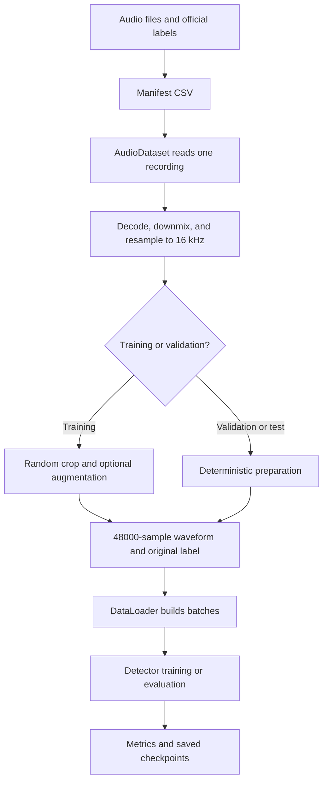

# What the recent pull adds to SvaraSentry

Reviewed on 5 September 2026. Incoming commit: `c7d5878` —
`feat: add reproducible audio augmentation pipeline`.

## Is augmentation ready?

**The augmentation module is implemented, integrated, and tested.** It includes
OpenSLR SLR28 noise/room assets and a real in-memory Opus/VoIP codec round-trip.

This means the code is ready to use, but we have not yet measured whether training
with it improves deepfake detection. That requires a controlled training experiment.

## What augmentation does, in simple words

Imagine a genuine recording saying “Hello, how are you?”
The module can make that recording quieter, add background noise, or make it
sound as though it was recorded in an echoing room. It is still genuine speech.
The same effects can be applied to synthetic speech, which remains synthetic.

The purpose is to help the model recognize real versus generated speech across
different microphones and recording conditions. Otherwise it could learn a
shortcut such as associating noisy recordings with one class.

Augmentation runs while preparing training examples. It does not create cloned
voices, choose labels, or make a deepfake prediction.

## Where the new modules fit



The dataset supplies the speech and label. Augmentation changes the sound.
The trainer teaches the model using those examples.

## Files and responsibilities

| New file | What it does |
|---|---|
| `training/augmentations.py` | Applies waveform effects, validates assets, controls randomness, and returns consistent audio |
| `training/audio_dataset.py` | Reads manifest rows, loads audio, converts it to mono/16 kHz, and prepares examples for the selected split |
| `training/configs/augmentation.yaml` | Controls effect probabilities, strengths, and asset paths |
| `training/configs/baseline.yaml` | Disables augmentation for a comparison experiment; this name refers to a no-augmentation experiment |
| `training/train.py` | Trains the detector, evaluates validation predictions, and saves results |
| `training/benchmark_loader.py` | Measures how quickly the data loader supplies batches |
| `training/augmentation_report.py` | Generates sample audio and transform metadata for inspection |
| `data_pipeline/build_asvspoof2019_la_manifest.py` | Builds a manifest using official ASVspoof protocols |
| `data_pipeline/prepare_split_manifest.py` | Combines externally assigned split manifests and checks cross-split path/group leakage |
| New tests and fixtures | Exercise augmentation, assets, dataset behavior, and manifest utilities |

The pull also updates Docker/dependency configuration and adds asset provenance
and training guides. It does **not** contain new mobile-relay or spectrogram UI
implementations.

## Implemented effects

| Effect | What the listener would notice | Starting configuration |
|---|---|---|
| Gain | Louder or quieter speech | -8 to +6 dB; probability 0.45 |
| Noise | Background sound mixed with speech | 8–35 dB signal-to-noise ratio; probability 0.45 |
| Room impulse response (RIR) | Room reverberation | Wet mix 0.20–0.80; probability 0.25 |
| Filtering/EQ | Different microphone tone or telephone bandwidth | Broad EQ up to ±6 dB; probability 0.25 |
| Resampling | Bandwidth/conversion changes | Intermediate sample rates, then back to 16 kHz; probability 0.25 |
| Speed | Slightly faster/slower speech, also changing pitch | Factor 0.95–1.05; probability 0.20 |
| Saturation | Mild overloaded-microphone distortion | Drive 1.1–1.8; probability 0.10 |
| Codec compression | Opus/VoIP encode-decode artifacts | 12, 16, or 24 kbps; probability 0.20 |

There is a top-level 20% chance to skip random effects. Otherwise effects are
sampled and capped at three per example. These probabilities are selection
settings, not guaranteed final percentages after the cap and clean-sample rule.
Even a sample with no effects can be cropped to fit the model window.

## What the module guarantees

- One-dimensional, contiguous float32 audio with exactly 48,000 samples.
- Finite output bounded to `[-1, 1]`.
- No modification of the input tensor in place.
- Real/fake labels remain outside the augmentation API.
- Validation and test preparation apply no random effects.
- Reproducible training randomness from seed, epoch, sample, worker, and rank.
- Noise mixing uses measured signal/noise levels.
- Asset decoding uses a bounded cache.
- Transform metadata is available for debugging through the augmenter/report API.

The standard dataset output contains waveform, label, sample ID, and manifest
metadata. It does not automatically log the full transform trace for every batch.

## Local asset setup

The default YAML points to:

```text
data/augmentation_assets/noise/
data/augmentation_assets/rir/
```

The SLR28 installer places assets at these paths on the training machine. Git
ignores the collection, so every training machine must install it locally.
An explicitly configured directory with no valid audio raises an error. The
tiny committed fixtures are for automated tests, not a realistic collection.

## Integration fixes made after pulling

Three compatibility issues were fixed locally:

1. **Our manifest uses `dev`.** The dataset now recognizes it as `validation`,
   preserving the official split. It also exposes `attack_type` as `fake_engine`
   metadata so evaluation can report results by attack.
2. **Worker epoch state.** Data-loader workers now restart between iterations,
   allowing the new epoch seed to reach worker copies of the dataset.
3. **Serving checkpoint format.** Alongside `best.pt`, the trainer now writes
   `model.pt` with `format_version`, `model_name`, `hidden_size`, `state_dict`,
   and metrics, matching the backend's expected core fields.

`best.pt` retains optimizer state and experiment information. There is not yet a
resume command that restores it automatically. The exported `model.pt` does not
include fitted probability calibration; that still needs implementation.

The pulled augmentation work, its integration fixes, and the earlier manifest
improvements are included together on the current branch.

## How this relates to our downloaded ASVspoof data

Our existing manifest is:

```text
data/manifests/dataset_manifest.csv
```

It contains 25,380 training rows and 24,844 development/validation rows. The
loader has been checked against this actual file and successfully decoded a
sample from each split into a 48,000-sample waveform.

Continue using this manifest for now. The newly pulled ASVspoof-specific builder
expects train, dev, **and eval** audio, whereas we downloaded/extracted only train
and dev. Running its default full-corpus command will fail on missing eval files.

Our existing protocol-aware command remains usable:

```bash
venv/bin/python data_pipeline/build_manifest.py \
  --asvspoof-root data/raw/LA \
  --output data/manifests/dataset_manifest.csv
```

It ignores the 142 development-directory files absent from the development
protocol. Labels must continue to come from the protocols.

## Training readiness and XLSR

The pull supplies a useful initial trainer: AdamW, binary cross-entropy,
validation ROC-AUC, average precision, approximate EER, false-positive rate,
metadata slices, and best-checkpoint selection.

However, the trainer currently performs full-precision training of all model
parameters. It does not yet implement mixed precision, gradient accumulation,
encoder freezing, early stopping, or probability calibration.

Those training improvements should precede a full XLSR run on the RTX 4060.
The successful XLSR inference smoke test does not establish training memory use;
gradients and optimizer state require additional memory.

XLSR is installed separately at:

```text
training/pretrained/wav2vec2-large-xlsr-53
```

The trainer accepts that directory through `--model-name`. Before using XLSR for
training, also implement its expected input normalization consistently in the
training and serving paths. This integration has not been completed by the pull.
Indian-language quality still needs labelled genuine and synthetic speech and
evaluation for the target languages.

## Verification completed

- 48 tests passed after the integration fixes.
- Ruff passed for backend, data pipeline, training, and tests.
- The actual manifest loaded with the expected train/validation counts.
- Real audio samples from both splits produced the expected tensor shape.

Rerun the checks from the project root:

```bash
venv/bin/python -m pytest -q
venv/bin/ruff check backend data_pipeline training tests
```

These checks establish code behavior and compatibility. A full GPU training run,
real-device relay testing, and a measured improvement from augmentation have not
been performed as part of this pull review.

## Next practical steps

1. Add the noise/RIR collection or configure those effects off.
2. Inspect generated augmented samples and benchmark the loader.
3. Add memory-aware training controls and consistent XLSR normalization.
4. Run a small GPU forward/backward training smoke test.
5. Compare training with and without augmentation using the same data splits.
6. Choose the configuration from measured validation performance, then evaluate
   a held-out test set when available.
