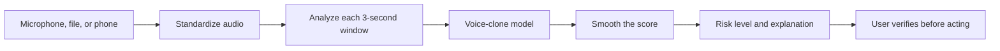
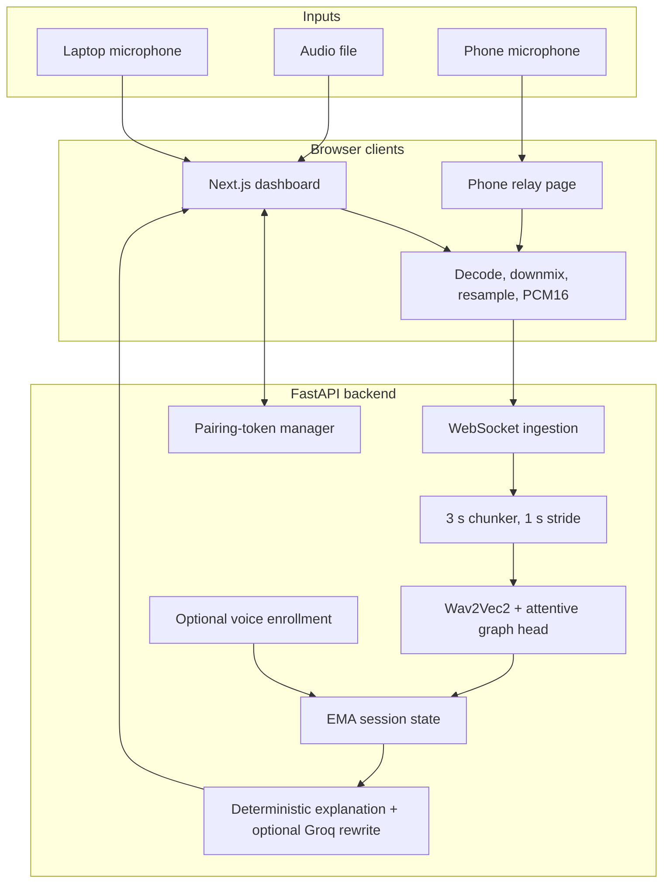

# SvaraSentry — Presentation-Ready Project Dossier

> **Document status:** Current project state as of 9 September 2026  
> **Repository revision inspected:** `main` at `8122674`, with additional uncommitted integration, training, relay, Docker, and documentation work  
> **Project version:** `0.2.0`  
> **Purpose:** A single source for presentations, demonstrations, viva questions, technical reviews, and honest discussion of current limitations

---

## 1. The project in one sentence

**SvaraSentry is a real-time voice-clone risk detector that listens to call or uploaded audio, analyzes overlapping three-second speech windows, and warns the user when the voice appears likely to be AI-generated.**

It is currently a strong research prototype. It performs very well on its held-out benchmark, and the complete website-to-model pipeline works. However, recent testing with live laptop microphones and Windows Voice Recorder exposed sensitivity to recording-channel and loudness changes. It must therefore be described as a **risk-assistance system**, not as definitive proof that a speaker is real or fake.

---

# Part I — Explain it to anyone

## 2. Fifteen-second introduction

Voice-cloning tools can imitate a person from a small amount of recorded speech. SvaraSentry listens to incoming audio and gives the user an early warning when the sound contains patterns associated with synthetic speech, helping the user pause and verify the caller before taking a sensitive action.

## 3. Thirty-second elevator pitch

SvaraSentry is designed for situations such as scam calls, impersonation attempts, support calls, and voice-based financial requests. A user can speak through a laptop microphone, upload an audio file, or relay phone audio to the dashboard. The system converts the sound into a consistent format, analyzes it with a fine-tuned multilingual speech model, and displays a continuously updated clone-risk score. The dashboard then recommends whether the user can continue, should exercise caution, or should independently verify the caller.

## 4. Two-minute explanation

A convincing fake voice may sound completely natural to a human. SvaraSentry looks for subtler acoustic patterns that people may not notice: timing, spectral texture, phase and compression artifacts, and inconsistencies produced by speech-synthesis or voice-conversion systems.

The audio is standardized to one channel and 16,000 samples per second. The backend analyzes the latest three seconds at a time, starting a new window every second. A pretrained multilingual speech encoder converts the waveform into learned representations. An AASIST-inspired classification head summarizes the time sequence and produces a synthetic-speech risk score.

While audio is active, the user sees a recent-window smoothed score rather than an unstable frame-by-frame reading. When the stream stops, the dashboard switches to a final arithmetic average across every analyzed window and also reports the peak score and fraction of high-risk windows. Low scores produce no alert, middle scores recommend caution, and high scores recommend verification. An optional language-model component rewrites the structured warning in clearer language, but it **cannot change the detector score or decision**.

The model achieved an audited 97.58% accuracy and 3.79% equal-error rate on its held-out evaluation set. Those numbers describe the evaluation distribution, not every microphone in the real world. Live Windows microphone and Recorder tests revealed false positives as high as 69% and 92% for genuine speech under some channel conditions. This is the principal issue to solve before real operational deployment.

## 5. The problem being solved

Voice cloning creates three difficulties:

1. **Humans cannot reliably detect every fake by ear.** Modern cloned voices can reproduce pronunciation, accent, tone, and speaking rhythm.
2. **Decisions happen during a conversation.** A detector is more useful if it provides continuous risk feedback rather than requiring a forensic process after the call.
3. **Real audio is messy.** Devices, rooms, codecs, fans, echoes, network compression, and different languages can alter the signal and confuse a model.

SvaraSentry addresses the first two problems end to end. Its next major research task is stronger robustness to the third.

## 6. What the user experiences

The user can:

- start the laptop microphone;
- upload WAV, FLAC, MP3, M4A, or OGG audio;
- connect a phone through a short-lived pairing flow;
- watch the current risk, timeline, signal quality, spectrogram, and explanation;
- optionally enroll a known voice as a second signal.

The user does **not** need to manually convert every input to 16 kHz mono FLAC. The browser decodes supported files, combines stereo channels into mono, resamples to 16 kHz, converts samples to PCM16, and streams them to the backend. FLAC is useful for preparing lossless training assets, but it is not required as the live network format.

## 7. What the three risk levels mean

| Level | Current score range | Meaning | Recommended action |
|---|---:|---|---|
| No alert | below `0.55` | The model found relatively little synthetic-speech evidence | Continue normally, while using ordinary judgment |
| Caution | `0.55` to below `0.879358` | The signal is uncertain or contains suspicious patterns | Avoid sensitive actions and ask an independent verification question |
| High risk | `0.879358` or higher | Strong evidence according to the present model | Stop or pause the action and verify through a trusted channel |

These values are model scores, not guaranteed real-world probabilities. A displayed `92%` means “the detector output was 0.92,” not “there is mathematically a 92% chance of fraud.”

## 8. What SvaraSentry is—and is not

### It is

- a real-time decision-support prototype;
- an end-to-end web, relay, backend, and ML system;
- a multilingual anti-spoofing research implementation;
- a tool for prompting safer verification behavior;
- a measurable foundation for further domain adaptation.

### It is not

- proof of identity;
- a replacement for multi-factor verification;
- a speaker-recognition system by default;
- guaranteed to recognize every unseen cloning method;
- production-ready for unsupervised high-stakes decisions in its current microphone-robustness state.

---

# Part II — Slide-ready presentation structure

The following section can be transferred directly into a presentation. Each slide includes suggested speaker notes.

## Slide 1 — Title

**SvaraSentry: Real-Time AI Voice Clone Risk Detection**

- Multilingual speech anti-spoofing
- Live microphone, file upload, and phone relay
- Wav2Vec2/XLSR encoder with an AASIST-inspired head
- Explainable, continuously updated risk guidance

**Speaker note:** Open with a simple scenario: “You receive an urgent call that sounds exactly like someone you trust. How do you decide whether the voice is genuine?”

## Slide 2 — Why this matters

- A short voice sample can be used to synthesize convincing speech.
- Scam decisions are often made under urgency and emotion.
- Human listening alone is not a dependable detector.
- Verification should be prompted while the conversation is still happening.

**Speaker note:** The objective is not to make an absolute accusation. It is to interrupt risky behavior at the right moment.

## Slide 3 — Proposed solution

SvaraSentry provides:

- continuous three-second audio analysis;
- a live clone-risk score and trend;
- clear no-alert, caution, and high-risk states;
- optional known-voice enrollment;
- structured and language-model-assisted explanations;
- phone-to-dashboard audio relay.

## Slide 4 — Simple system flow



**Speaker note:** “The website prepares the sound, the backend groups it into windows, the model scores each window, and the interface converts that score into an actionable warning.”

## Slide 5 — Input handling

- Files accepted: WAV, FLAC, MP3, M4A, OGG
- Browser microphone input is usually captured at the device rate, commonly 48 kHz
- Stereo is reduced to mono
- All input is resampled to 16 kHz
- Audio is transported as signed 16-bit PCM frames through WebSocket

**Speaker note:** Users do not need to preprocess live inputs manually.

## Slide 6 — Core model

- Encoder: local `wav2vec2-large-xlsr-53`
- Classifier: compact temporal-graph, AASIST-inspired head
- Attention-based mean and standard-deviation pooling
- Total parameters: `317,005,188`
- Selected deployed checkpoint: Phase A, epoch 3

**Speaker note:** Call it “AASIST-inspired,” not canonical AASIST. The implementation borrows temporal graph and attentive pooling ideas but is deliberately compact.

## Slide 7 — Dataset composition

| Category | Clips |
|---|---:|
| Fake | 45,141 |
| Real | 6,039 |
| Total | 51,180 |
| Training | 26,143 |
| Development/evaluation | 25,037 |

Sources include ASVspoof LA, team recordings, C-DAC Kannada and Tamil, Odia speech, and Sarvam-generated clones.

**Speaker note:** The strong class imbalance is handled explicitly during training; it is not ignored.

## Slide 8 — Language distribution

| Language | Fake | Real | Total |
|---|---:|---:|---:|
| English | 45,120 | 5,134 | 50,254 |
| Kannada | 12 | 303 | 315 |
| Odia | 4 | 301 | 305 |
| Tamil | 5 | 301 | 306 |

**Speaker note:** The corpus is overwhelmingly English and fake samples in Indian languages are very limited. Therefore, “multilingual-capable prototype” is defensible; “equally validated across languages” is not.

## Slide 9 — Leakage-aware splitting

- ASVspoof uses its official train/development partitions.
- Team recordings are split by whole speaker, never by clip.
- Five team speakers are assigned to training and Harish to development.
- C-DAC Kannada/Tamil lack usable speaker IDs, so a fixed-seed row split is used and documented as a limitation.
- Odia contains speaker IDs: 67 speakers train, 17 development, with no overlap.
- Hindi was excluded because one-speaker coverage was insufficient; originals were preserved.

## Slide 10 — Training-time augmentation

For each training clip:

- 20% chance of staying unchanged;
- otherwise, at most three independently chosen effects;
- gain, noise, reverb, resampling, filtering, speed/pitch, Opus compression, and saturation;
- final input standardized to 3 seconds, 16 kHz, mono.

**Speaker note:** Augmentation teaches robustness by making the same speech sound as if it came through different rooms, devices, networks, and volume levels. Validation audio is not augmented.

## Slide 11 — Two-phase training

| Phase | Encoder state | Epochs | Trainable parameters | Learning rates |
|---|---|---:|---:|---|
| A | Entire encoder frozen | 3 | 1,566,468 | Head `3e-4` |
| B | Top four encoder layers unfrozen | 5 | 51,953,412 | Head `5e-5`, encoder `5e-6` |

Common settings: batch size 1, gradient accumulation 8, effective batch 8, weighted binary cross-entropy, AMP, seed 42.

## Slide 12 — Why Phase A won

- Phase A epoch 3 achieved the lowest validation EER.
- Unfreezing the top four encoder layers did not improve EER.
- Phase B EER ranged from 5.61% to 7.22%.
- The system therefore deploys the earlier Phase A winner, not the final epoch.

**Speaker note:** Later training is not automatically better. Model selection was based on the chosen validation metric.

## Slide 13 — Audited benchmark results

| Metric | Result |
|---|---:|
| Accuracy at 0.5 | 97.58% |
| Precision | 99.22% |
| Recall | 98.05% |
| F1 | 98.63% |
| ROC AUC | 0.9736 |
| PR AUC | 0.9916 |
| Equal-error rate | 3.79% |
| EER operating threshold | approximately 0.879 |

At threshold 0.5: TN 2,558; FP 172; FN 435; TP 21,872.

## Slide 14 — Where performance is weaker

- ASVspoof EER: approximately 3.51%
- Odia real-only accuracy: 76.67% (14 of 60 flagged incorrectly at the evaluated threshold)
- Team slice: only 13 samples, so its percentage is unstable
- Tamil evaluation contains only five fake samples
- Unknown-source/attack slice EER: approximately 18.16%
- Attack A06 had 313 misses and 91.58% recall

**Speaker note:** Aggregate accuracy is dominated by ASVspoof and must not be presented as uniform multilingual performance.

## Slide 15 — End-to-end application

- Next.js/React frontend
- FastAPI backend
- WebSocket streaming
- Session-based score smoothing
- QR/short-token phone pairing
- Optional LangChain/Groq explanation layer
- Dockerized production deployment

## Slide 16 — Security and privacy design

- Raw audio is processed in memory and is not persisted by the backend.
- Pairing tokens are short-lived, opaque, and single-use.
- Production containers use read-only filesystems, dropped capabilities, and non-root execution.
- Model and pretrained assets are mounted read-only.
- The Groq key is mounted as a Docker secret, not baked into the image.
- Local HTTPS/WSS relay uses a generated certificate authority that must be trusted on the phone.

## Slide 17 — Real-world microphone finding

Observed genuine-speech scores:

- saved in-dataset English FLAC: about 3%;
- live English with fan/external voice: 63–64%;
- live English without fan/external voice: 69%;
- live Tamil: 31%;
- live Kannada: 19%;
- Windows Recorder M4A genuine recording: final windows about 92%.

**Speaker note:** This is the most important current limitation. The model is reacting to recording-channel conditions, not only voice authenticity.

## Slide 18 — Root-cause evidence

- The M4A was AAC-LC, 48 kHz, stereo, about 192 kbps, and 20.75 seconds.
- Conversion to 16 kHz mono did not remove the high-score segment.
- Early windows scored below 5%; scores rose sharply around seconds 8–10.
- A controlled `+14 dB` change on one genuine three-second window moved its score from `0.0047` to `0.8984`.
- Therefore, channel/loudness sensitivity is demonstrated—not merely guessed.

## Slide 19 — What must be improved

1. Collect real and fake samples through the exact deployment channels.
2. Include laptop microphones, browsers, Windows Recorder, phones, rooms, fans, and codec paths.
3. Define one consistent training-and-inference amplitude policy.
4. Retrain or domain-adapt using device-stratified splits.
5. Calibrate scores on a deployment-like calibration set.
6. Report false-positive rate per device, language, noise condition, and speaker.
7. Add confidence/abstention for unsupported or low-quality inputs.

## Slide 20 — Final conclusion

SvaraSentry demonstrates:

- a complete real-time anti-spoofing pipeline;
- strong in-distribution evaluation performance;
- reproducible training and checkpoint selection;
- multilingual and phone-relay foundations;
- explainable risk guidance;
- a clearly measured path from prototype to robust deployment.

**Closing line:** “The project has moved beyond a model demo into a complete system; the remaining challenge is not connectivity, but trustworthy generalization across real recording channels.”

---

# Part III — Technical dossier

## 9. Functional requirements

The system is designed to:

1. accept audio from file, laptop microphone, or paired phone;
2. normalize the stream format automatically;
3. perform repeated low-latency inference;
4. show a stable, interpretable risk trend;
5. retain no raw audio by default;
6. support optional enrolled-voice comparison;
7. produce deterministic guidance even if the external explanation service is unavailable;
8. run reproducibly through Docker;
9. train on GPU outside the CPU-oriented production container;
10. expose health and configuration information for operational checks.

## 10. High-level architecture



## 11. Audio concepts in plain language

### Sample rate

The sample rate is how many measurements of the sound wave are stored every second. `48 kHz` means 48,000 measurements per second. `16 kHz` means 16,000. Speech understanding usually does not require the additional high-frequency content of 48 kHz audio, and the pretrained model expects 16 kHz.

### Mono and stereo

- **Mono** has one audio channel.
- **Stereo** has left and right channels.

The model expects mono. The browser averages multiple channels into one waveform.

### PCM

Pulse-code modulation represents the measured waveform directly as numbers. `PCM16` uses signed 16-bit integers from -32,768 to 32,767. It is simple, uncompressed, and easy for the backend to reassemble.

### Codec and container

FLAC, AAC, MP3, and Opus describe ways audio is encoded or compressed. M4A is commonly a container holding AAC audio. Once the browser decodes a file, the model receives waveform samples rather than the original container.

### dBFS

Decibels relative to full scale measure digital signal level. `0 dBFS` is the maximum representable level; normal audio is negative. A value near `-35 dBFS` is much quieter than `-10 dBFS`.

### Window and stride

- **Window:** the amount analyzed at once—three seconds.
- **Stride:** how far the analysis advances—one second.

Because the stride is smaller than the window, adjacent windows overlap by two seconds. This gives frequent updates without losing context.

## 12. Input and streaming path

### File upload

1. The user selects a supported audio file.
2. `decodeAudioData` obtains floating-point waveform samples.
3. Channels are averaged to mono.
4. Linear interpolation resamples the signal to 16 kHz.
5. Samples are quantized to PCM16.
6. Frames are sent over the audio WebSocket.

### Laptop microphone

1. `getUserMedia` requests one channel with browser echo cancellation and noise suppression.
2. The device commonly supplies 48 kHz audio.
3. The browser downmixes/resamples it to 16 kHz and sends PCM16 frames.
4. The current implementation uses `ScriptProcessorNode` with 4,096-sample blocks.

`ScriptProcessorNode` is deprecated. It works today but should be replaced with `AudioWorklet` for better scheduling and future compatibility.

### Phone relay

1. The dashboard asks the backend for a short-lived pairing token.
2. A QR code opens the phone relay URL.
3. The phone consumes the token and opens its audio WebSocket.
4. Phone PCM16 frames enter the same backend chunker and model.
5. Results return to the dashboard WebSocket.

Pairing-token reuse is rejected. Intentional socket close and reconnect behaviors were smoke-tested. On a physical phone, HTTPS/WSS requires the locally generated certificate authority to be trusted.

## 13. Backend windowing and session state

- Target sample rate: 16,000 Hz
- Window length: 48,000 samples = 3 seconds
- Stride: 16,000 samples = 1 second
- WebSocket frame limit: 64 KiB
- One active audio source per session
- Session time-to-live: 3,600 seconds
- Maximum sessions: 200
- Risk smoothing: exponential moving average with `alpha = 0.35`

The exponential moving average is:

```text
smoothed_new = 0.35 × raw_new + 0.65 × smoothed_previous
```

It makes the display less jittery, but it also means a previous high score decays gradually rather than disappearing immediately.

When an input stops, the backend separately calculates:

```text
final average risk = sum of every fused raw window risk / number of analyzed windows
```

The dashboard then labels the gauge **FINAL AVERAGE RISK** and shows the window count, maximum observed risk, and percentage of windows that crossed the high-risk threshold. The final alert level is derived from the arithmetic average. Peak and high-risk-window fraction remain visible because an average alone can dilute a short suspicious segment.

The backend resets smoothing when a new audio socket connects. The dashboard should also reset its visible timeline between independent tests; otherwise, old points can appear next to new ones even though backend scoring is fresh.

## 14. Model architecture

### Encoder

The encoder is the locally stored multilingual `wav2vec2-large-xlsr-53`. Wav2Vec2 learns representations directly from raw audio. XLSR extends this approach through cross-lingual pretraining, making it a useful foundation for Indian-language audio even when the final anti-spoofing data is imbalanced.

### Classification head

The custom head is a compact AASIST-inspired design:

- projected hidden dimension: 256;
- temporal graph blocks: 2;
- attention heads: 4;
- dropout: 0.15;
- attentive mean and standard-deviation pooling;
- final binary logit for fake versus real.

The attentive pooling learns which time regions matter instead of treating every frame equally. Standard-deviation pooling preserves information about variation over time. The graph-style blocks model relationships among temporal features.

### Parameter counts

| State | Trainable parameters | Meaning |
|---|---:|---|
| Complete model | 317,005,188 total | Encoder plus classifier |
| Phase A | 1,566,468 | Classifier/head only |
| Phase B | 51,953,412 | Head plus top four encoder layers |

## 15. Dataset inventory

### Manifest totals

| Split | Fake | Real | Total |
|---|---:|---:|---:|
| Train | 22,834 | 3,309 | 26,143 |
| Development | 22,307 | 2,730 | 25,037 |
| Total | 45,141 | 6,039 | 51,180 |

### Source totals

| Source | Fake | Real | Notes |
|---|---:|---:|---|
| ASVspoof LA | 45,096 | 5,128 | Dominant benchmark source |
| C-DAC Kannada | 0 | 300 | Public real speech |
| C-DAC Tamil | 0 | 300 | Public real speech |
| Odia speech corpus | 0 | 300 | Public real speech |
| Aditi | 8 | 2 | Team/Sarvam material |
| Diya | 8 | 2 | Team/Sarvam material |
| Harish | 11 | 2 | Held-out team speaker |
| Keerti | 0 | 1 | Real only in active manifest |
| Praj | 8 | 2 | Team/Sarvam material |
| Pranathi | 10 | 2 | Team/Sarvam material |

The active manifest contains 11 team-real files. Earlier raw folders can contain additional preserved originals, including excluded Hindi material; preserved files are not equivalent to included training rows.

### Directly scanned non-ASV duration

| Group | Files | Approximate duration |
|---|---:|---:|
| Public real corpora | 900 | 114.31 minutes |
| Included team real | 11 | 66.44 minutes |
| Included team/Sarvam fake | 45 | 52.34 minutes |

Public-real duration by source:

- C-DAC Kannada: approximately 40.75 minutes;
- C-DAC Tamil: approximately 38.67 minutes;
- Odia: approximately 34.89 minutes.

These duration figures exclude ASVspoof and describe current manifest-linked, locally scanned non-ASV assets.

## 16. Data preparation and format

Training files are converted to 16 kHz mono FLAC because FLAC is lossless, space-efficient, and consistent. The manifest stores paths plus metadata such as label, source, language, speaker, attack, and split.

Public datasets were streamed from Hugging Face so that only the required approximately 300 rows per language were materialized rather than downloading multi-gigabyte datasets in full.

Before training, checks verified that manifest paths existed and that expected sources and languages were not silently dropped. Licenses of upstream datasets must still be verified before redistribution or commercial deployment.

## 17. Split methodology and leakage prevention

Speaker leakage happens when the same person's voice appears in training and evaluation. A model can then learn the person rather than the distinction between genuine and fake speech.

The implemented strategy is:

- **ASVspoof:** preserve official partitions;
- **team recordings:** assign each entire person to one split;
- **C-DAC Kannada/Tamil:** deterministic row-level split with seed 42 because the dataset does not expose a reliable speaker identifier;
- **Odia:** group split using 84 speaker identities—67 train and 17 development, no overlap.

The C-DAC choice is a known source-metadata limitation, not an unnoticed error.

## 18. Augmentation pipeline

Augmentation is enabled for training samples only.

### Selection policy

- 20% probability: leave the clip unchanged;
- otherwise: sample up to three transformations independently;
- randomness is deterministic and changes by epoch, supporting reproducibility without presenting the identical augmented signal every epoch.

### Effects

| Effect | Probability | Typical range or purpose |
|---|---:|---|
| Gain | 45% | `-8` to `+6 dB`; simulates volume variation |
| Background noise | 45% | SNR 8–35 dB; simulates real environments |
| RIR/reverb | 25% | Wet mix 0.2–0.8; simulates rooms |
| Resampling | 25% | Intermediate 8, 12, 22.05, or 24 kHz; device/conversion artifacts |
| Filtering | 25% | Includes a telephone-style possibility; changes frequency response |
| Speed/pitch | 20% | Rate approximately 0.95–1.05 |
| Opus/VoIP | 20% | 12, 16, or 24 kbps; network-call artifacts |
| Saturation | 10% | Drive approximately 1.1–1.8; clipping/nonlinearity |

After augmentation, a waveform is padded or cropped to three seconds and supplied at 16 kHz mono.

The library contains approximately 935 noise assets and 60,325 room impulse responses. Augmentation smoke checks cover representative rows before full training.

## 19. Loss and imbalance handling

The binary target is fake versus real. Because fake clips greatly outnumber real clips, ordinary unweighted loss would overemphasize the fake class. Training uses weighted binary cross-entropy with fake positive weight approximately `0.144915`.

This reduces the penalty contribution of the majority fake class relative to the real class. It does not create new data and does not solve domain imbalance by itself.

## 20. Training configuration

| Setting | Value |
|---|---|
| Hardware | NVIDIA GeForce RTX 4060 Laptop GPU, 8 GB VRAM |
| Native environment | Windows CUDA training; Docker production inference is CPU-oriented |
| Batch size | 1 |
| Gradient accumulation | 8 |
| Effective batch size | 8 |
| Phase A epochs | 3 |
| Phase B epochs | 5 |
| Phase A head LR | `3e-4` |
| Phase B head LR | `5e-5` |
| Phase B encoder LR | `5e-6` |
| Weight decay | 0.01 |
| Gradient clipping | 1.0 |
| Mixed precision | Enabled |
| Phase B gradient checkpointing | Enabled |
| Data-loader workers | 0, chosen for Windows stability |
| Seed | 42 |
| Validation | All 25,037 development clips after every epoch |

Low VRAM use during Phase A was expected: the encoder was frozen, the per-step batch was one, and mixed precision reduced memory use. CPU utilization was also expected because decoding, augmentation, batching, and host-to-device preparation occur outside the GPU.

## 21. Per-epoch results

| Epoch | Accuracy | Precision | Recall | F1 | ROC AUC | PR AUC | EER | EER threshold |
|---|---:|---:|---:|---:|---:|---:|---:|---:|
| A1 | 84.73% | 99.12% | 83.61% | 90.70% | 0.9512 | 0.9937 | 12.01% | 0.38137 |
| A2 | 93.27% | 99.65% | 92.77% | 96.09% | 0.9913 | 0.9989 | 4.68% | 0.30935 |
| **A3** | **97.58%** | **99.22%** | **98.05%** | **98.63%** | **0.9736** | **0.9916** | **3.85%** | **0.87936** |
| B1 | 81.42% | 99.82% | 79.29% | 88.38% | 0.9803 | 0.9970 | 5.61% | 0.14563 |
| B2 | 88.09% | 99.78% | 86.83% | 92.85% | 0.9796 | 0.9970 | 6.40% | 0.19078 |
| B3 | 88.84% | 99.81% | 87.65% | 93.33% | 0.9846 | 0.9980 | 6.05% | 0.26297 |
| B4 | 92.95% | 99.31% | 92.74% | 95.91% | 0.9845 | 0.9980 | 6.41% | 0.45345 |
| B5 | 80.96% | 99.94% | 78.68% | 88.05% | 0.9831 | 0.9979 | 7.22% | 0.10322 |

The bold row is the selected checkpoint. The independently audited post-training EER was 3.7876%, with threshold 0.87851; the small difference from the training-time 3.85%/0.87936 reflects the evaluation calculation path, not a different model.

## 22. Metric definitions

- **Accuracy:** fraction of all correct decisions. It can be misleading under imbalance.
- **Precision:** among clips predicted fake, how many were actually fake.
- **Recall:** among fake clips, how many were detected.
- **F1:** harmonic mean of precision and recall.
- **ROC AUC:** ranking quality across thresholds using true- and false-positive rates.
- **PR AUC:** precision-recall ranking quality, especially informative under imbalance.
- **False positive:** real audio incorrectly flagged as fake.
- **False negative:** fake audio incorrectly accepted as real.
- **EER:** operating point where false-accept and false-reject rates are approximately equal; lower is better.

## 23. Detailed evaluation

### Confusion matrix at threshold 0.5

| | Predicted real | Predicted fake |
|---|---:|---:|
| Actual real | 2,558 | 172 |
| Actual fake | 435 | 21,872 |

### Confusion matrix near the EER threshold

| | Predicted real | Predicted fake |
|---|---:|---:|
| Actual real | 2,626 | 104 |
| Actual fake | 840 | 21,467 |

Raising the threshold reduces false alarms but misses more fakes. This is an operating-policy trade-off, not a free improvement.

### Slice results

| Slice | Result | Interpretation |
|---|---|---|
| ASVspoof | ~97.64% accuracy, ~3.51% EER | Strong in the dominant benchmark domain |
| C-DAC Kannada | 95% real-only accuracy | 3 false positives among 60; no fake examples in this slice |
| C-DAC Tamil | 100% real-only accuracy | No fake examples, so not a complete detector evaluation |
| Odia | 76.67% real-only accuracy | 14 false positives among 60; significant concern |
| Team | 69.23% accuracy, ~4.55% EER | Only 13 samples; too small for stable conclusions |
| Unknown source/attack | ~89.12% accuracy, ~18.16% EER | Generalization weakness |

Attack A06 is the weakest large ASVspoof attack slice, with 91.58% recall and 313 missed fake clips.

## 24. Threshold behavior on real evaluation clips

| Threshold | Real false positives | Real false-positive rate |
|---:|---:|---:|
| 0.50 | 172 | 6.30% |
| 0.55 | 165 | 6.04% |
| 0.589 | 159 | 5.82% |
| 0.75 | 133 | 4.87% |
| ~0.879 | 104 | 3.81% |

The current caution threshold `0.55` is a legacy heuristic. The high threshold is validation-derived. A proper deployment should calibrate both thresholds on device- and use-case-matched data, with explicit false-alarm and miss-cost objectives.

## 25. Why the model can be wrong on a real microphone

The model receives raw floating-point waveform amplitude after PCM conversion. It does not currently apply an explicit, invariant waveform normalization such as per-window zero-mean/unit-variance normalization.

During training it can therefore learn two types of cues:

1. **desired cues:** features genuinely related to synthesis or voice conversion;
2. **shortcut cues:** loudness, codec, microphone frequency response, background processing, or corpus-specific recording characteristics.

If training real and fake sources were recorded through different pipelines, source characteristics can correlate with the label. The model may then perform extremely well on similar held-out data but react incorrectly to a new recorder.

### Measured Recorder example

The inspected genuine file was:

- format: M4A containing AAC-LC;
- native sample rate: 48 kHz;
- channels: stereo;
- duration: 20.75 seconds;
- approximate bitrate: 192 kbps;
- size: 527,295 bytes.

After the normal 16 kHz mono conversion, the first windows were low risk, but the score rose sharply:

| Window end | Raw score | Smoothed score |
|---:|---:|---:|
| 3 s | 0.0047 | 0.0047 |
| 7 s | 0.0360 | 0.0243 |
| 8 s | 0.2059 | 0.0879 |
| 9 s | 0.3554 | 0.1815 |
| 10 s | 0.8902 | 0.4295 |
| 12 s | 0.9273 | 0.7257 |
| 16 s | 0.9820 | 0.9307 |
| 20 s | 0.9222 | 0.9021 |

The UI showed the latest/high portion, not one whole-file average. A `+14 dB` experiment on a genuine three-second segment changed its score from `0.0047` to `0.8984`, confirming severe gain/channel sensitivity.

### What will not solve it safely

- merely renaming or converting the file to FLAC;
- simply raising the threshold until this sample passes;
- adding inference-only normalization without retraining;
- hiding the displayed percentage;
- assuming the benchmark accuracy applies unchanged to laptop microphones.

## 26. Robustness remediation plan

### Phase 1 — Build a deployment-channel evaluation set

For every consenting speaker and language, record paired genuine speech through:

- direct lossless recording;
- browser microphone;
- Windows Voice Recorder M4A;
- at least two laptop/USB/phone microphones;
- quiet room, fan, background speech, echo, and different distances;
- phone relay with HTTPS/WSS;
- representative codecs and network paths.

Generate or replay fake speech through the same channels. Otherwise, device cues may remain correlated with the class.

### Phase 2 — Define consistent signal handling

Evaluate candidate policies such as peak normalization, RMS normalization, pre-emphasis, or learned front-end normalization. Any selected policy must be applied identically during training, validation, file upload, browser microphone, and phone relay.

### Phase 3 — Retrain/domain-adapt

- mix balanced real/fake examples per channel;
- strengthen gain/channel augmentation beyond the present range only after controlled tests;
- consider channel-adversarial or source-balanced training;
- retain a device-disjoint validation and test set;
- use early stopping by the deployment metric, not only aggregate ASVspoof EER.

### Phase 4 — Calibrate

Fit score calibration on a separate calibration split. Choose thresholds from business costs, for example:

- false alarms per 100 genuine calls;
- fake misses per 100 attacks;
- abstention rate on low-quality or unsupported audio.

### Phase 5 — Acceptance criteria

Do not call the live path production-ready until it meets agreed limits for:

- real false-positive rate per device and language;
- fake recall per attack family;
- cross-speaker and cross-device generalization;
- score stability under reasonable gain changes;
- relay latency and reconnect behavior;
- confidence behavior on silence and non-speech.

## 27. Inference and risk fusion

Without voice enrollment:

```text
risk = fake-model score
```

With an enrolled voice:

```text
risk = 0.8 × fake-model score + 0.2 × (1 - voice similarity)
```

Enrollment is a secondary signal, not cryptographic identity proof. The 80/20 weighting is a product heuristic and should be validated before high-stakes use.

## 28. Explainability and LangChain agent

The backend always creates a deterministic structured explanation from measurable information such as risk level, signal quality, recent score behavior, and identity state.

When enabled, LangChain with Groq rewrites that information into natural language:

- provider: Groq;
- configured model: `openai/gpt-oss-20b`;
- call cadence: first result and then every fifth chunk;
- fallback: deterministic explanation if unavailable or invalid.

The language model cannot modify the detector score, threshold, or alert class. It is a presentation layer, not the classifier. The API key is stored outside source control and mounted read-only as a Docker secret. No secret value should appear in slides, logs, screenshots, or the repository.

## 29. API and WebSocket surface

### HTTP endpoints

| Method | Path | Purpose |
|---|---|---|
| GET | `/` | Service information |
| GET | `/health` | Health, model/checkpoint, and agent state |
| GET | `/api/config` | Client-safe runtime configuration |
| GET | `/api/sessions` | Session summary |
| GET | `/api/sessions/{id}` | Current session state/result |
| POST | `/api/sessions/{id}/reset` | Reset session state |
| POST | `/api/sessions/{id}/pairing-token` | Create phone pairing token |
| POST | `/api/sessions/{id}/enrollment` | Add voice enrollment |
| DELETE | `/api/sessions/{id}/enrollment` | Remove enrollment |

### WebSockets

| Path | Purpose |
|---|---|
| `/ws/dashboard/{id}` | Send results to the dashboard |
| `/ws/audio/{id}` | Receive dashboard/browser audio |
| `/ws/audio/pair/{token}` | Receive phone audio after token validation |

## 30. Frontend

The frontend uses Next.js 16, React 19, TypeScript, Tailwind CSS, Framer Motion, and QR rendering.

Routes:

- `/` — landing page;
- `/app` — analysis dashboard;
- `/phone` — mobile relay interface.

Dashboard components include:

- current clone-risk gauge;
- alert recommendation;
- session trend;
- spectrogram/acoustic view;
- signal-quality indicators;
- processing latency and analyzed-window count;
- optional voice-identity enrollment;
- explanation panel;
- microphone, upload, and phone-connect controls.

## 31. Docker deployment

### Production services

| Service | URL/port | Role | Approximate image size |
|---|---|---|---:|
| Frontend | `http://127.0.0.1:3000` | Next.js UI | 306 MB |
| Backend | `http://127.0.0.1:8000` | FastAPI + CPU inference | 2.19 GB |

Backend API documentation is available at `http://127.0.0.1:8000/docs` and health at `http://127.0.0.1:8000/health`.

Production hardening includes:

- non-root backend user;
- read-only root filesystem;
- all Linux capabilities dropped;
- `no-new-privileges`;
- temporary writable storage through `tmpfs`;
- read-only model and pretrained-model mounts;
- restart policy `unless-stopped`;
- Docker secret for the Groq key.

### Why several Docker images can appear

The repository has separate backend and frontend images, plus development and production variants. They are not four replicas of the model:

- backend development image;
- frontend development image;
- backend production image;
- frontend production image.

Production and development also use different dependency/layout choices. Plain `docker compose` attempts to start development containers on the same ports as production and will fail if production already owns ports 3000 and 8000.

Build cache has been intentionally retained to speed future rebuilds. It can consume several gigabytes and is not evidence that extra models are running.

## 32. Training versus inference environments

- **Training:** native Windows CUDA, because the RTX 4060 substantially accelerates the 317-million-parameter model.
- **Production Docker:** CPU inference for portability and predictable setup.

This is why the Docker backend image uses CPU-oriented dependencies while training used CUDA. A future GPU production profile could be added separately; it should not silently replace the portable baseline.

## 33. Test and verification coverage

The complete automated suite passes, with one intentional environment-dependent skip. Coverage includes:

- API health and session behavior;
- pairing-token creation, consumption, expiry, reuse rejection, and revocation;
- WebSocket PCM streaming and inference responses;
- checkpoint loading and smoke inference;
- manifest collection and split behavior;
- augmentation behavior and reproducibility;
- training integration;
- explainability and provider fallback;
- secure relay smoke tests;
- frontend lint, type checking, and production build.

Representative end-to-end scores on known files were:

- genuine Pranathi clip: about `0.0326`;
- cloned Pranathi clip: about `0.9142`;
- genuine stored Harish English clip: approximately `0.006–0.04`, depending on evaluated crop;
- cloned Harish test: approximately `0.92`.

These demonstrate pipeline correctness, not universal microphone robustness.

## 34. Training incident and recovery

The full run took approximately 13 hours 12 minutes, including about 56 minutes of outage.

Timeline highlights:

- 8 Sep, 21:45 — training started;
- 9 Sep, 00:24 — Phase A epoch 3 completed and became the eventual winner;
- 06:23 — Phase B epoch 3 completed;
- 06:40 — Windows performed a clean critical-battery shutdown after AC power was removed;
- 07:37 — training resumed from the saved Phase B epoch-3 model and optimizer state;
- 09:27 — Phase B epoch 4 completed;
- 10:57 — Phase B epoch 5 and the full run completed with exit code 0.

No CUDA out-of-memory error, NaN loss, data corruption, validation failure, or Python traceback caused the interruption. Approximately 3,900 partial Phase B epoch-4 steps were repeated after resume; no completed epoch or dataset portion was silently lost.

A power guard now checks status periodically and logs low-power conditions. During the setup, two launcher-only Windows issues were corrected: quoting paths containing spaces and representing the `0x80000000` priority flag as a signed 32-bit value.

## 35. Checkpoints and artifacts

| Artifact | Approximate size | Purpose |
|---|---:|---|
| Phase A best | 1.19 GiB | Selected winner |
| Phase B best | 1.57 GiB | Best Phase B state, includes more optimizer/trainable state |
| Phase B last | 1.57 GiB | Final training state |
| Exported service checkpoint | 1.18 GiB | Backend deployment artifact |
| Local XLSR pretrained weights | ~1.27 GB | Base encoder assets |

The deployed file is `training/checkpoints/model.pt`, exported from the Phase A epoch-3 winner. The original winner is retained at `runs/xlsr-full/phase-a-best.pt`.

## 36. Security, privacy, and abuse considerations

### Implemented

- Raw streamed audio is not saved by default.
- Pairing tokens are high-entropy, short-lived, consumed once, and scoped to a session.
- Browser policies restrict microphone use to the application origin.
- Security headers include content-security, no-sniff, referrer, and permissions controls.
- Secrets are ignored by Git and mounted into containers rather than embedded.
- Production containers have reduced privileges.

### Still required for public deployment

- user authentication and authorization;
- API and WebSocket rate limiting;
- strict allowed-origin validation;
- TLS certificates from a trusted deployment authority;
- audit logging without retaining sensitive voice content;
- consent, retention, and deletion policy;
- abuse monitoring and incident response;
- threat modeling against replay, adversarial perturbation, and model extraction;
- legal review of biometric/voice processing requirements;
- upstream dataset-license verification.

## 37. Current project status

| Area | Status | Evidence/qualification |
|---|---|---|
| Data pipeline | Complete for current corpus | 51,180-row manifest, split and path checks |
| Model training | Complete | Eight scheduled epochs, exit code 0 |
| Model selection/export | Complete | Phase A epoch 3 deployed |
| Benchmark evaluation | Complete | Audited metrics and breakdowns |
| Backend integration | Complete | Checkpoint mode reported healthy |
| Browser/file streaming | Complete | End-to-end smoke tests pass |
| Phone relay | Functionally complete | Secure local relay smoke-tested; physical-device matrix still needed |
| Frontend | Complete for prototype | Production build/lint/type checks pass |
| Docker production stack | Complete | Healthy frontend and backend services |
| Explanation agent | Complete with fallback | Groq optional; no effect on detector score |
| Live microphone robustness | **Not complete** | Documented genuine false positives/channel sensitivity |
| Production security/operations | Partial | Container hardening exists; auth/rate-limit/public TLS still needed |

## 38. Honest claims for a presentation

### Safe claims

- “We built and tested an end-to-end real-time voice-clone risk-detection prototype.”
- “The selected checkpoint achieved 97.58% accuracy and approximately 3.79% EER on the held-out evaluation manifest.”
- “The system supports live microphone input, common uploaded formats, and phone relay.”
- “We use leakage-aware speaker grouping wherever source metadata permits.”
- “The system exposes its current domain-shift limitation and has a concrete validation plan.”

### Claims to avoid

- “It is 97.58% accurate on all real-world calls.”
- “A 92% score means 92% probability the speaker is fake.”
- “It works equally well in English, Kannada, Tamil, and Odia.”
- “It identifies the caller.”
- “It is production-ready for banking decisions.”
- “Converting audio to 16 kHz FLAC guarantees correct detection.”

---

# Part IV — Demonstration runbook

## 39. Before the presentation

1. Connect the laptop to AC power and disable sleep for the presentation period.
2. Start Docker Desktop and wait for the engine to become ready.
3. Start the production Compose profile.
4. Confirm backend health reports `checkpoint_loaded: true`.
5. Open the dashboard at `http://127.0.0.1:3000/app`.
6. Use a new session ID or reset the session before each independent sample.
7. Prepare one known genuine file, one known cloned file, and one live-microphone example.
8. Do not expose the Groq secret in the terminal or slides.
9. If using a phone, pre-trust the local certificate and test the exact network path.

## 40. Recommended demo sequence

### Demo A — Known genuine file

Use a held-out, known genuine clip. Explain that the browser is decoding and resampling automatically. Expect a low score for a known working sample, but state that this is a demonstration sample, not a guarantee for every recorder.

### Demo B — Known fake file

Use a cloned sample and show the score entering the high-risk range. Point out the risk timeline, number of analyzed windows, signal-quality indicators, and explanation.

### Demo C — Phone relay

Create a pairing QR code, connect the phone, send audio, and show results appearing on the laptop dashboard. Explain that the token is short-lived and single-use.

### Demo D — Live microphone, framed honestly

Treat the live test as an engineering experiment. If a genuine sample scores high, use it to explain domain shift and why responsible validation matters. Do not recalibrate or change thresholds immediately before the presentation merely to make the demo appear correct.

## 41. If something goes wrong during the demo

| Symptom | Likely cause | Response |
|---|---|---|
| Frontend unavailable | Container not running/port conflict | Check production Compose status and ports 3000/8000 |
| Health says fallback model | Checkpoint mount/path problem | Stop the demo decision claim; inspect `/health` and model mount |
| Phone cannot use mic | Untrusted HTTPS certificate or browser permission | Trust certificate, verify secure URL, grant microphone permission |
| No score for first seconds | Window not full yet | Wait at least three seconds; updates then arrive every second |
| Score remains visually high | EMA/history or continued high windows | Stop stream, reset/new session, explain smoothing |
| Genuine mic flagged high | Known channel-domain issue | State limitation; compare with controlled file and avoid asserting fraud |
| Groq explanation absent | Network/key/provider issue | Deterministic explanation should continue; detector is unaffected |

## 42. Suggested live narration

> “The input may start as 48 kHz stereo or compressed M4A. The browser converts it into the 16 kHz mono waveform expected by the model and streams uncompressed PCM16 frames. The backend analyzes three seconds at a time with one-second overlap. The score is smoothed for readability, mapped to a risk band, and accompanied by guidance. The language model only rewrites that guidance; it never changes the detector result.”

---

# Part V — Viva and question bank

## 43. Problem and product questions

### Why not ask users to judge the voice themselves?

Synthetic voices can preserve identity cues that humans rely on. The detector is intended as an additional signal that prompts independent verification.

### Why call it a risk detector rather than a fake-voice detector?

The score is uncertain, distribution-dependent, and affected by recording conditions. “Risk” correctly communicates that it informs a decision rather than proving authenticity.

### Who would use it?

Potential users include call centers, financial-support staff, enterprises, families facing impersonation scams, and investigators triaging audio. Each use case requires separate calibration and policy.

### What is the project's main contribution?

The contribution is the integration of a trained multilingual anti-spoofing model into a real-time, explainable, multi-input system, combined with reproducible data preparation, training, recovery, evaluation, relay, and container deployment.

## 44. Audio questions

### Why 16 kHz?

The encoder expects 16 kHz, and most speech information needed by the model fits within that sampling regime. A consistent rate also prevents input-shape and feature mismatch.

### Why mono?

The model is trained for one waveform channel. Stereo would introduce an extra dimension and device-dependent spatial differences.

### Why PCM16 over WebSocket instead of FLAC?

PCM16 is simple to generate incrementally and decode with minimal latency. FLAC is useful for files but requires framing/compression work that adds complexity to real-time streaming.

### Does resampling create a fake voice?

No. Resampling changes representation bandwidth and can add small artifacts, but it does not synthesize a new identity. A robust detector should tolerate ordinary resampling.

### Why wait three seconds?

The model needs sufficient speech context. Shorter windows reduce latency but may not contain enough evidence; longer windows increase delay. Three seconds is the current engineering compromise.

### Why overlap windows?

One-second stride supplies a new decision every second while retaining three seconds of context.

### What happens to silence?

Signal-quality features can identify low-energy input, but a production system should have stronger voice-activity gating and abstain rather than treat silence as confident evidence.

## 45. Machine-learning questions

### Why Wav2Vec2/XLSR?

It is pretrained on large multilingual speech data and provides useful representations without learning speech acoustics from scratch. XLSR helps cross-lingual transfer.

### Why an AASIST-inspired head?

Anti-spoofing depends on patterns distributed across time. Temporal graph processing and attentive statistical pooling can focus on informative regions and variation while remaining smaller than the encoder.

### Is this exactly AASIST?

No. It is a compact AASIST-inspired classifier, not a reproduction of the canonical spectro-temporal graph architecture.

### Why freeze the encoder first?

Freezing reduces memory and computation, stabilizes early training, and allows the classifier to learn the task without immediately damaging pretrained features.

### Why unfreeze only the top four layers?

Higher layers are more task-specific, while lower layers capture general acoustic structure. Partial unfreezing limits cost and catastrophic forgetting.

### Why did Phase B get worse?

More trainable capacity can overfit or shift useful pretrained representations. The small learning rate reduced but did not eliminate that risk. Validation-based selection correctly kept Phase A.

### Why batch size one?

The encoder is large and the laptop has 8 GB VRAM. Gradient accumulation over eight steps provides an effective batch of eight without exceeding memory.

### What is mixed precision?

Some operations use lower-precision floating point, reducing memory and often increasing GPU throughput while retaining stable training through scaling.

### What is gradient checkpointing?

It saves memory by recomputing selected intermediate activations during backpropagation rather than storing all of them.

### Why class-weighted loss?

There are far more fake than real clips. Weighting prevents the majority class from dominating the objective.

### Why select by EER rather than accuracy?

Accuracy depends heavily on one threshold and class balance. EER summarizes a security-relevant trade-off between accepting fakes and rejecting real speech.

### Is ROC AUC enough?

No. AUC measures ranking across thresholds but does not choose an operating point or expose subgroup failures. EER, PR AUC, confusion matrices, and slice metrics are also reported.

## 46. Data questions

### Why use ASVspoof?

It is a recognized logical-access anti-spoofing benchmark with many real and synthetic/converted speech examples and attack labels.

### Why add team and public Indian-language data?

They add target-language, target-speaker, and real-world variation not represented adequately by the dominant English benchmark.

### Why were only about 300 public clips taken per language?

The objective was targeted coverage without downloading very large source datasets. Streaming materialized only the needed rows.

### Why exclude Hindi?

Only one speaker/source had meaningful Hindi coverage, making language and identity effects inseparable. Exclusion is safer than presenting unsupported Hindi performance. Originals remain preserved for future balanced collection.

### Is every language balanced?

No. English dominates, and non-English fake counts are extremely small. This is explicitly reported.

### How is data leakage prevented?

Speaker-group splits are used where identity metadata exists. ASVspoof official splits are preserved. C-DAC lacks speaker IDs, so its deterministic row split retains a documented residual risk.

### Are public-data licenses cleared?

They must be checked source by source before redistribution or commercial use. Technical availability does not automatically grant deployment rights.

## 47. Augmentation questions

### Does every clip receive every augmentation?

No. Twenty percent remain unchanged. For the rest, up to three effects are independently selected, so the combination changes across samples and epochs.

### Why preserve unchanged clips?

The model must still learn the original distribution. If every sample is distorted, it may learn augmentation artifacts instead.

### Why augment validation data?

It is not augmented. Validation must remain stable so epoch comparisons are meaningful.

### Why did augmentation not prevent the Recorder false positive?

Synthetic augmentation approximates channels but cannot cover every real device pipeline. The existing gain range and source mix were insufficient, and training data may still correlate source characteristics with labels.

## 48. Inference and calibration questions

### Is the output a probability?

It is a sigmoid-derived score used for ranking and thresholds. Without dedicated calibration on deployment-like data, it should not be interpreted as a literal probability.

### Why smooth the live result?

Individual windows can fluctuate. EMA smoothing makes the user interface easier to follow and gives recent history some influence.

### What happens when analysis stops?

The system finalizes the stream and changes the main gauge from live EMA risk to the arithmetic average of all fused raw window scores. It also displays the peak and high-risk-window fraction so the average is not the only evidence.

### Can smoothing hide a short attack?

Yes. Any temporal aggregation trades responsiveness for stability. Raw and smoothed scores should both remain available for analysis, and policy should be tested against short attacks.

### Why is 0.55 the caution threshold?

It is a current heuristic, not a fully calibrated deployment threshold. The high threshold near 0.879 comes from the validation EER operating point.

### Why not just raise the threshold after false positives?

That would reduce false positives but increase missed fakes, and it would not address the underlying domain shift. Thresholds should be calibrated on representative data.

## 49. Microphone limitation questions

### Why did uploaded training-like audio work but Windows Recorder fail?

They pass through different microphones, automatic gain controls, codecs, rooms, noise suppressors, and amplitude distributions. The model appears to have learned some of these channel cues.

### Does M4A cause the problem?

Not by itself. The browser successfully decodes it, and conversion to 16 kHz mono did not eliminate the high score. M4A/AAC is one component of the overall channel.

### Why did the score change partway through one file?

The model scores overlapping local windows. The genuine file's first seven windows were low, while later speech regions produced high scores. During the original diagnosis, the UI's final value represented the latest smoothed windows rather than a whole-recording average. The stop flow has since been changed to display the arithmetic all-window average together with the peak and high-risk-window fraction.

### Can normalization fix it?

Potentially, but not safely as an inference-only patch. The chosen normalization must be evaluated and applied consistently during retraining and inference because a quick amplitude change was shown to change the model score dramatically.

### Does this invalidate the project?

It invalidates a claim of universal live-microphone reliability, not the engineering system or benchmark result. Detecting and quantifying this failure is an important validation outcome and defines the next experiment.

## 50. Backend and relay questions

### Why WebSocket instead of repeated HTTP uploads?

WebSocket maintains a bidirectional low-overhead connection suitable for continuous frames and immediate results.

### What does the relay do?

It lets a phone act as the microphone while the laptop displays analysis. It transports audio; it does not run a separate detector.

### Why use pairing tokens?

They bind a phone connection to a selected dashboard session without exposing a reusable session credential in the QR flow.

### Is the relay secure on a local network?

It supports HTTPS/WSS with a trusted local certificate. A real deployment needs publicly trusted TLS, authentication, strict origins, and rate limiting.

### Is audio stored?

The current backend processes frames in memory and retains result/session state, not raw audio. Operational logs and future features must preserve that privacy promise.

## 51. Docker and operations questions

### Why are there separate frontend and backend containers?

They use different runtimes, dependencies, security boundaries, and build lifecycles. Separation also allows independent scaling or replacement.

### Why are images large?

The backend contains PyTorch and speech-model runtime dependencies, while development images include build tools and source dependencies. Local pretrained weights and checkpoints add separate storage.

### Does four images mean four applications are running?

No. Development and production variants can coexist as stored images. The active production application uses one frontend and one backend container.

### Why not train inside the production container?

The production image is optimized for portable CPU inference and reduced attack surface. Training requires CUDA libraries, writable checkpoints, and a different operational profile.

## 52. Security questions

### Can the language-model agent override a result?

No. It only rewrites bounded explanatory content. Deterministic fallback continues if the provider fails.

### Where is the API key?

It is stored in a Git-ignored secret file and mounted read-only through Docker secrets. It should be rotated if ever exposed in chat, terminal history, logs, or screenshots.

### What attacks remain possible?

Replay, adversarial audio, denial of service, unauthorized session access, pairing interception on an improperly secured network, and new synthesis methods are all relevant threats.

## 53. Project-management questions

### Was training lost during the shutdown?

No completed epoch was lost. Model and optimizer state resumed from Phase B epoch 3. Only the unfinished portion of epoch 4 was repeated.

### What was the shutdown root cause?

Windows initiated a clean critical-battery shutdown after external power was removed. It was not a model, CUDA, memory, or disk failure.

### Is retraining required?

For a controlled prototype using known files, the current model can be retained. For a claim of dependable live microphone/Recorder operation, retraining or domain adaptation plus calibration is required.

### What is the immediate next milestone?

A device- and channel-balanced validation corpus, followed by consistent signal normalization experiments and a retrained/calibrated checkpoint.

---

# Part VI — Roadmap

## 54. Immediate: stabilize the prototype

- add a visible “prototype risk score, not probability” label;
- reset the frontend trend automatically for every new independent recording/file;
- preserve raw and smoothed scores in debug telemetry without storing raw audio;
- add voice-activity and low-quality abstention rules;
- replace `ScriptProcessorNode` with `AudioWorklet`;
- test Chrome/Edge plus physical Android/iOS relay paths;
- freeze and commit a reproducible release revision.

## 55. Short term: fix channel robustness

- create paired device/channel data;
- test normalization alternatives offline;
- add same-channel real/fake balance;
- retrain with source-balanced sampling;
- evaluate device-disjoint and speaker-disjoint splits;
- calibrate caution and high thresholds;
- report confidence intervals for small slices.

## 56. Medium term: production engineering

- authentication and role-based access;
- WebSocket rate limiting and origin checks;
- deployment-grade TLS and secret management;
- structured observability and privacy-preserving audit records;
- GPU inference option and load testing;
- model registry, signed checkpoint provenance, rollback;
- automated drift monitoring;
- accessibility and localization of guidance.

## 57. Research extensions

- multi-task channel-invariant representation learning;
- explicit replay detection;
- ensemble of waveform and spectrogram models;
- calibrated uncertainty and out-of-distribution rejection;
- continual evaluation against new clone generators;
- stronger speaker-verification fusion;
- per-language adapters where adequate balanced data exists;
- explainability grounded in validated acoustic measurements rather than free-form claims.

---

# Part VII — Glossary

| Term | Simple definition |
|---|---|
| Anti-spoofing | Detecting fake, replayed, converted, or synthesized biometric input |
| ASVspoof | A standard research corpus/challenge for automatic speaker-verification spoofing |
| Attack type | A generator or transformation family used to create fake speech |
| AASIST | An anti-spoofing architecture using integrated spectro-temporal graph attention |
| AMP | Automatic mixed precision for faster, lower-memory GPU work |
| Calibration | Mapping scores to reliable decision meaning on representative data |
| Channel | The recording/transmission path: microphone, room, codec, network, processing |
| Checkpoint | Saved model weights and, during training, optional optimizer/resume state |
| Codec | A method for encoding/compressing audio, such as AAC, FLAC, MP3, or Opus |
| Data leakage | Evaluation information unintentionally available during training |
| Domain shift | Deployment audio differs from the training/evaluation distribution |
| EER | Error point at which fake acceptance and real rejection are approximately equal |
| EMA | Exponential moving average that smooths recent scores |
| Encoder | Network component that turns raw audio into learned feature representations |
| False negative | Fake audio incorrectly treated as real |
| False positive | Real audio incorrectly flagged as fake |
| FLAC | Lossless compressed audio format |
| Gradient accumulation | Combining gradients from several small steps before an optimizer update |
| Inference | Running a trained model to obtain a prediction |
| Logit | Raw classifier output before the sigmoid transformation |
| Manifest | Table mapping audio files to labels and metadata |
| Mono | A single audio channel |
| PCM16 | Uncompressed waveform samples represented as signed 16-bit integers |
| RIR | Room impulse response used to simulate reverberation |
| Resampling | Converting audio from one sample rate to another |
| ROC/PR AUC | Threshold-independent measures of ranking quality |
| Sample rate | Number of waveform measurements stored per second |
| SNR | Signal-to-noise ratio |
| Speaker leakage | The same person's voice occurs in both training and evaluation |
| Stride | Distance between the starts of adjacent analysis windows |
| Threshold | Score boundary used to select an alert state |
| WebSocket | Persistent bidirectional web connection for streaming frames/results |
| Window | Fixed audio duration scored as one model input |
| XLSR | Cross-lingual speech-representation pretraining variant of Wav2Vec2 |

---

# Part VIII — One-page presenter cheat sheet

## 58. Numbers to remember

- **51,180** total manifest rows
- **45,141 fake / 6,039 real**
- **26,143 train / 25,037 development**
- **3 seconds** per model window
- **1 second** stride
- **16 kHz mono PCM16** streaming format
- **317.0 million** total model parameters
- **3 Phase A + 5 Phase B epochs**
- **Phase A epoch 3** selected
- **97.58%** held-out accuracy at threshold 0.5
- **3.79%** audited EER
- **~0.879** EER/high-risk threshold
- **~13 h 12 min** full training runtime including outage
- **300 each** public-real Kannada, Tamil, and Odia clips
- **RTX 4060 Laptop GPU, 8 GB** used for training
- **ports 3000 and 8000** for frontend and backend

## 59. Three strengths

1. Complete end-to-end implementation, not just an offline notebook.
2. Strong benchmark result with reproducible training, resume, evaluation, and checkpoint export.
3. Honest slice analysis and a measured understanding of the present channel-generalization failure.

## 60. Three limitations

1. English/ASVspoof dominates the corpus; multilingual fake coverage is tiny.
2. Genuine laptop/Recorder audio can be falsely flagged because of channel/gain sensitivity.
3. Public deployment still needs authentication, calibration, broader device testing, and license/legal review.

## 61. Best answer to “Is it production-ready?”

> “The application pipeline and Docker deployment are complete for a research prototype, and the checkpoint is strong on its held-out benchmark. It is not yet ready to make autonomous high-stakes decisions from arbitrary live microphones because we measured channel-dependent false positives. The next release requires deployment-channel data, retraining/domain adaptation, and calibrated device-disjoint evaluation.”

## 62. Best answer to “What did you learn?”

> “A high benchmark score is only one layer of validation. End-to-end testing showed that the browser, relay, backend, and model work, but also revealed that a model can learn recording-source shortcuts. The most valuable result is therefore both the functioning prototype and the evidence-driven plan to make it robust.”

---

## 63. Repository reference map

| Area | Main location |
|---|---|
| Backend API and WebSockets | `backend/main.py` |
| Runtime configuration | `backend/config.py` |
| Checkpoint inference | `backend/model_inference.py` |
| Pairing security | `backend/pairing.py` |
| Explanation agent | `backend/langchain_agent.py` |
| Frontend dashboard | `frontend/components/dashboard.tsx` |
| Phone relay | `frontend/components/phone-relay.tsx` |
| Browser audio conversion | `frontend/lib/audio.ts` |
| API/WS client | `frontend/lib/api.ts` |
| Manifest builder | `data_pipeline/build_manifest.py` |
| Public audio extractor | `data_pipeline/extract_huggingface_audio.py` |
| Dataset loader | `training/audio_dataset.py` |
| Augmentation pipeline | `training/augmentations.py` |
| Model definition | `training/model.py` |
| Training loop | `training/train.py` |
| Evaluation | `training/evaluate.py` |
| Checkpoint export | `training/export_checkpoint.py` |
| Production Compose | `compose.production.yaml` |
| Development Compose | `compose.yaml` |
| Full training audit | `docs/full-training-report-2026-09-09.md` |
| Current-session progress | `docs/current-session-progress-report.md` |
| Windows migration guide | `docs/windows-complete-migration-guide.md` |

---

## 64. Final presentation takeaway

SvaraSentry is best presented as a **responsibly evaluated real-time voice-clone risk platform**. Its value lies in four things working together: a trained anti-spoofing model, a complete streaming application, actionable user guidance, and transparent validation. The current model is convincing on the benchmark and on controlled known files. The live-recorder tests also show exactly where the next scientific work must focus: channel-invariant learning, representative device data, and calibrated real-world decisions.

That combination—demonstrated capability plus clearly measured limitations—is stronger and more defensible than claiming perfect detection.
